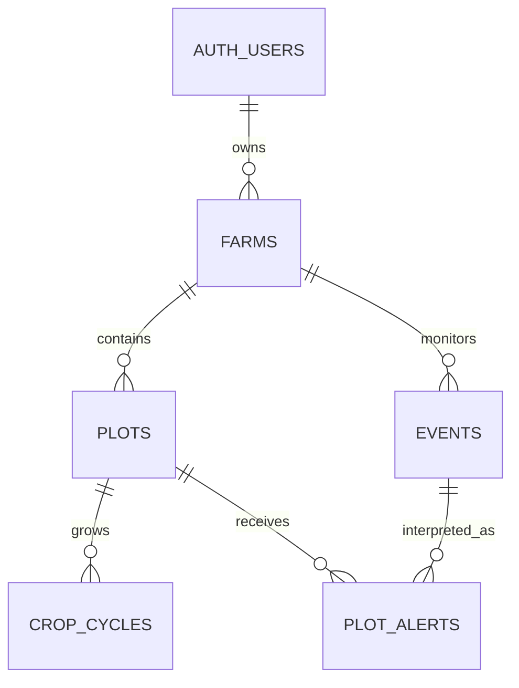

# AgroSense: MVP domain and build scope

Status: proposed MVP design, 2026-09-12. No database migration, provider
integration, or dashboard implementation has been applied.

Source: [HACKCBA / AgroSense product document](https://docs.google.com/document/d/1tcxZBTNtnSFpBFIxwPe1tD6QwrSWgnngrScm1vnrx-g/edit?tab=t.0)
and the supplied three-column sketch. Technical boundaries: [stack.md](stack.md).
Confirmed scope: the document's **24-hour hackathon demo**. Live-pilot
requirements are listed separately as expansion points.

## The result to prove

One user opens one seeded farm with two or three plots. They see satellite
imagery in the center, land/crop information on the left, and recent/upcoming
hazard cards on the right. Selecting a plot synchronizes all three areas.

The demonstration must show **the same forecast producing different,
explainable risk assessments for different crops or declared growth stages**.
A plot without sufficient context shows unknown risk, not low risk.

Start with maize and soybean, frost only, one forecast adapter, and one satellite
basemap. Keep a deterministic simulated frost scenario for the demo. A live
forecast adapter is a subsequent slice; obtaining a dramatic real forecast is
not a dependency for demonstrating the product.

| Area | MVP behavior |
| --- | --- |
| Left: Datos del campo | Farm/plot name, declared hectares, current crop and declared stage, latest forecast with its timestamp |
| Center: map | One satellite basemap, seeded farm/plot polygons, fit-to-farm, selected-plot highlight, source attribution |
| Right: events | Time, source, affected plots, per-plot risk, explanation and suggested action; ongoing/upcoming first and recent forecasts below |

The satellite basemap is visual context. Rainfall/temperature rasters, image-date
selection, NDVI, and a Copernicus processing pipeline are outside this MVP.
A forecast passing into the past remains a forecast, not a confirmed occurrence.
A basemap with unknown acquisition date must say so; do not call it live imagery.

## Simplification decisions

The earlier proposal described 17 tables and several independent lifecycles.
Build **five application tables**, plus Supabase's existing Auth users, when
persistence is introduced. The first screen can use fixtures with the same
shared contracts before the database exists.

| Earlier design | MVP decision | Add the richer model when… |
| --- | --- | --- |
| Membership and roles | One `owner_id` on each farm | A second person needs shared access |
| Crop/stage catalogs and rule tables | Typed, versioned application configuration | Agronomists need to edit/publish rules without a code release |
| Shared regional events, plot associations, separate assessments | Farm-scoped `events` and one current `plot_alerts` row per event/plot | Multiple providers or regional deduplication is necessary |
| Immutable event revisions and assessment history | Keep current results with evidence snapshots | Users need historical reports, audit, or external notifications |
| Durable processing jobs and retries | One bounded refresh; retry on the next refresh | Monitoring requires reliable delivery, longer jobs, or larger fan-out |
| Weather samples and map frame tables | Latest forecast summary on the farm; configured satellite basemap | Weather/imagery time-series exploration ships |
| Notification subscriptions/deliveries | Web timeline only | A messaging channel and real recipients are ready |
| Spatial matching and PostGIS | Seeded GeoJSON; forecasts sampled at known plot locations | Users import land or need regional hazard intersection |

These are scope cuts, not guarantees that a simpler implementation provides the
same capabilities. The MVP has no historical audit, multi-provider reconciliation,
guaranteed background completion, or outbound notification delivery.

## Five-table schema

`id uuid PK` and `created_at timestamptz` are present on all tables; mutable rows
also have `updated_at`. `?` means nullable; other fields are required. These are
proposed definitions, not executable SQL. Use snake_case in SQL and camelCase in
Zod/TypeScript API contracts. Persist instants in UTC; use the farm timezone for
display. Store planting/stage dates as `date`.

| Table | Fields beyond common fields | Required constraints |
| --- | --- | --- |
| `farms` | `owner_id uuid FK auth.users`, `name text`, `province text`, `locality text?`, `timezone text`, `boundary_geojson jsonb`, `declared_area_ha numeric`, `data_version int`, `forecast_summary jsonb?`, `last_attempt_at timestamptz?`, `last_success_at timestamptz?`, `last_error_code text?` | Positive area/version. Timezone defaults to `America/Argentina/Cordoba`. Ownership and version are server-managed. Forecast summary has a shared schema and per-plot provenance. |
| `plots` | `farm_id uuid FK farms`, `name text`, `boundary_geojson jsonb`, `sample_point_geojson jsonb`, `declared_area_ha numeric` | Unique `(farm_id, name)` and `(id, farm_id)`; positive area. Seeded boundaries/sample points validated before import. No boundary editor in the MVP. |
| `crop_cycles` | `plot_id uuid FK plots`, `crop_code text`, `season_label text`, `sown_on date?`, `stage_code text?`, `stage_as_of date?`, `ended_on date?` | At most one open cycle per plot via partial unique index. Crop/stage combination must exist in configuration; stage code/date occur together. Initial cycles are seeded; season rollover is deferred. |
| `events` | `farm_id uuid FK farms`, `source_code text`, `source_event_key text`, `kind text`, `title text`, `starts_at timestamptz`, `ends_at timestamptz?`, `issued_at timestamptz`, `retrieved_at timestamptz`, `source_url text?`, `status text`, `evidence jsonb`, `is_demo boolean` | Unique `(farm_id, source_code, source_event_key)` and `(id, farm_id)`. MVP kind `frost`; status `active` or `cancelled`. End is after start when present. Evidence is validated and includes units/location. |
| `plot_alerts` | `farm_id uuid FK farms`, `plot_id uuid`, `event_id uuid`, `assessment_state text`, `risk_level text?`, `reason text`, `recommendation text?`, `input_snapshot jsonb`, `rule_version text`, `generated_at timestamptz`, `valid_until timestamptz`, `generation_method text` | Unique `(plot_id, event_id)`. Composite FKs `(plot_id, farm_id)` and `(event_id, farm_id)` prevent cross-farm links. Only evaluated results have a risk level. Each row is the current result, replaced on refresh. |

Keep **crop cycles** even in the MVP: crop/stage describes a period of cultivation,
not a permanent land attribute. Keeping that boundary costs one small table and
avoids rewriting plot identity when the crop changes. Only declared stages are
supported; do not infer a stage from planting date alone. Reject a future stage
observation or one before a known sowing date.

GeoJSON uses `[longitude, latitude]`. Validate geometry structure, coordinate
ranges, closed rings, and input size. Seed fixtures must also be checked for
valid polygons, containment, and plausible sample points. `declared_area_ha` is
explicitly declared area; do not imply it was measured from the polygon. Before
accepting arbitrary user land geometry, add full spatial validation and area
calculation, preferably in PostGIS.

`forecast_summary` contains at most one latest forecast bundle per plot:
plot ID, provider, issuance/retrieval time, forecast validity, units, and the
bounded values used by the screen and rules. It is a typed cache, not an arbitrary
bag of fields or a source of ownership relationships.

`input_snapshot` records the actual event evidence and crop/stage data used,
including units, rule version, and demo mode. It supports explaining the current
card. Replacing a row discards the previous assessment; the UI must not promise
historical assessment details. A later history feature needs append-only results.

## Forecasts and risk: one simple path

1. Load the seeded plots and active crop cycles.
2. Read the simulated forecast adapter, or the single configured live adapter.
3. Identify frost intervals from the bounded forecast horizon.
4. Evaluate a small set of explicit, typed crop/stage rules.
5. Produce normalized events and plot-specific alert cards.
6. Atomically publish the result, then return it through the dashboard API.

Provider metadata, crop/stage options, and risk rules live in versioned code.
Use a small rule shape with crop, applicable stages, temperature/duration
conditions, measurement context, risk level, evidence reference, and a text
template. There is no generic rule language, SQL rule editor, or agent framework.

`assessment_state`: `evaluated`, `insufficient_data`, `no_applicable_rule`.
`risk_level`: `low`, `moderate`, `high`; null for unassessed results. Missing
measurements do not become zero. A duration measurement needs its threshold and
time interval. A forecast air temperature cannot silently stand in for a
crop-apex measurement. Unreviewed thresholds run only as explicitly synthetic
rules with simulated data; real advice requires reviewed agronomic evidence.

The deterministic template is the baseline. If AI is needed for the hackathon
track, add one bounded LLM call to express supplied evidence in plain language,
with template fallback. It does not choose risk or invent missing facts. Record
`generation_method` as `template` or `llm`; include model/prompt version in the
snapshot when used. Confirm track requirements separately: optional wording
generation alone should not be represented as satisfying an AI-core requirement.

Use farm-scoped events deliberately. For a simulated regional frost, one event
can have multiple plot alerts. For live point forecasts, do not merge different
plot forecasts merely because they occur on the same day. The adapter defines a
stable event key that includes forecast location and episode identity; distinct
locations may produce distinct events. Return per-plot evidence honestly rather
than implying verified regional coverage. A complete newer forecast may cancel
an earlier upcoming event; a failed or partial fetch cannot imply cancellation.
Cancelled events are labelled and excluded from active-risk counts and current
recommendations, even if a previous plot alert had a high risk level.

## Refresh and failure behavior

Start with a **Refresh** button calling the Worker. After that works, use the same
function from one scheduled invocation, with its interval configured for the
chosen provider. No queue, lease, multi-stage workflow, or background service is
required for this bounded demo.

Read `farms.data_version` before fetching data. In one database transaction/RPC,
verify it is unchanged, reject provider issuance older than the stored forecast,
upsert events, replace their current plot alerts, update the forecast summary and
success time, then increment the version. Crop/stage mutations also increment
the farm version in their transaction. If the version changed, discard the
refresh and retry on the next request/tick. A late response cannot overwrite a
newer committed forecast or cultivation change. Never hold a database transaction
open during provider or LLM calls.

A failed fetch/publish leaves the previous successful snapshot intact. Record a
bounded error code and attempt time only if the original version still matches;
a late failed attempt must not mark a newer success as failed. A crash can lose
that attempt, and recovery is the next refresh. That is an explicit demo tradeoff.

Reads use one database snapshot and mark alerts stale when their crop context or
rule version differs, or when `valid_until` has passed. Render pending/stale
states after a crop edit until refresh completes. For incomplete results use the
next configured recheck time; never assign an already expired validity deadline.
Configure freshness limits alongside the provider/rules; unavailable data is
visibly different from a successful result with no hazards.

Keep a rolling seven-day recent window and seven-day forecast horizon. Recent
cards are earlier forecasts, not damage reports. Reconcile upcoming events only
after a complete successful fetch for their location/window; preserve unaffected
and recent rows, remove rows older than retention, and cascade only their current
plot alerts. No indefinite evidence retention is promised in the MVP.

## API and implementation boundaries

Keep the existing React/Vite frontend, Hono Worker, and shared Zod contracts.
Use Supabase Auth with a seeded owner account when deploying private farm data;
local fixtures need no cloud credentials. Do not implement signup, invitations,
roles, land import, or farm creation screens for this demo.

| Endpoint | MVP contract |
| --- | --- |
| `GET /api/farms/:farmId/dashboard` | Farm summary, plots with active crops, GeoJSON, configured basemap descriptor, latest forecast, grouped event/alert cards, freshness and demo mode |
| `POST /api/farms/:farmId/refresh` | Runs the bounded refresh; returns its status; the client reloads the dashboard on success |
| `PATCH /api/farms/:farmId/plots/:plotId/crop-cycle` | Updates the seeded active crop/stage with an expected farm data version; returns the new version and marks previous risk stale |

UI selection/filtering happens locally because the dataset is small. Start with
one `dashboard.ts` and one `cultivation.ts` in `packages/contracts`; infer TS types
from Zod schemas. Validate adapter input and API boundaries. The dashboard is a
read model, not another database table. Fetch raster tiles outside dashboard JSON.

Bound the initial implementation to 10 plots, 50 event cards, 5,000 total boundary
coordinate positions, and 1 MiB dashboard JSON per farm. Seed fixtures fit these
limits; reject over-limit data rather than hiding land or partially publishing a
refresh. Avoid per-plot database queries by reading/joining in batches. Add list
pagination and spatial endpoints only when raising these limits.

Farm data is owner-only. Enable RLS on private tables and trace child access to
`farms.owner_id`. User mutations use the owner-scoped API/RPC; clients cannot
write forecast/alert rows, change ownership, or bypass the version increment.
Privileged scheduled writes stay server-side. Do not put service keys in the
browser. Keep responses private; clear farm caches on logout. Provider URLs are
configured, not user-selected fetch targets. Rate-limit manual refresh and set
provider/LLM deadlines and input/output bounds.

Retain the current JSON error envelope. Use 401 for unauthenticated requests,
404 for inaccessible farm/plot IDs, 409 for a version conflict, 422 for invalid
cultivation data, and 503 for unavailable refresh data. Demo mode is explicit
and propagated from input to every forecast/card. Never silently substitute mock
weather for failed live weather.

## Build order and acceptance

1. **Fixture-backed page:** the three panels work with one shared response schema;
   plot selection updates details/highlighting and event cards. No database needed.
2. **Risk demonstration:** the seeded forecast produces different results for two
   declared stages; missing stage produces unknown risk; show rule/evidence.
3. **Persistence:** add the five tables, seed owner/land/cultivation, and replace
   fixtures behind the same API contract; enforce owner access and atomic refresh.
4. **One live integration:** implement the forecast adapter with timeout/freshness
   states and manual refresh; schedule only after the manual path works.
5. **Optional AI explanation:** one grounded call with deterministic fallback,
   only if required for the presentation. External messaging remains deferred.

For code changes, run the repository's `pnpm check`. Add focused tests for risk
variants, missing data, crop/stage validation, cross-owner access, stale refresh
rejection, and atomic failure preserving the previous snapshot. Check the page
in a browser at desktop and narrow widths. Documentation changes need structural
and consistency checks, not an application build.

Before calling it a live farmer pilot, revisit provider/imagery permissions and
coverage, reviewed agronomic rules, durable monitoring/retry requirements,
historical evidence, and support for warnings being revised or cancelled. Those
are explicit expansion points, not prerequisites for a fixture-backed demo.
