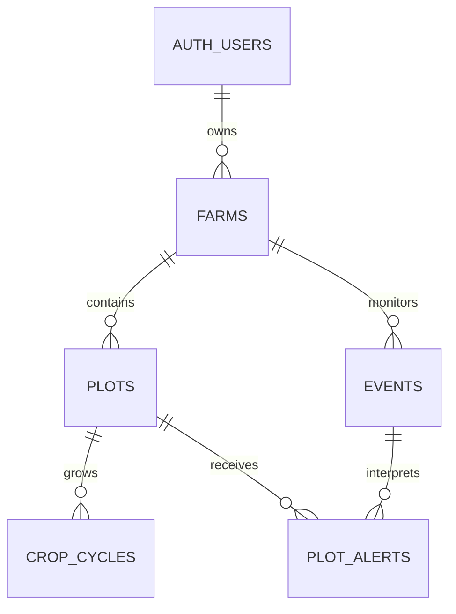

# AgroSense: MVP schema reference v1

Status: implementation reference for the confirmed **24-hour hackathon demo**.
This change defines schemas; it does not provision a database or implement routes.

Source: [AgroSense product document](https://docs.google.com/document/d/1tcxZBTNtnSFpBFIxwPe1tD6QwrSWgnngrScm1vnrx-g/edit?tab=t.0)
and the three-column sketch. Stack: [stack.md](stack.md).

## Which reference to use

| File | Authority |
| --- | --- |
| [mvp-schema.sql](reference/mvp-schema.sql) | Exact five-table PostgreSQL DDL: columns, defaults, nullability, keys, indexes, deletion behavior, timestamps, read policies and grants |
| [mvp.openapi.json](reference/mvp.openapi.json) | OpenAPI 3.1: all request/response types, enums, JSONB schemas, field limits, null handling, auth and errors |
| [dashboard.example.json](reference/dashboard.example.json) | Complete valid example of the dashboard response; fixed synthetic dates and one plot keep it readable |
| This document | Meaning of fields, cross-field validation, transaction rules, derivations and build scope |

Implement these definitions directly. SQL is authoritative for persistence;
OpenAPI is authoritative for wire/JSON structure. Rules below cover checks that
need several rows, the current time, or existing stored data. An inconsistency
between references is a defect to fix, not an invitation to choose either shape.

The SQL is a fresh-database reference requiring existing Supabase Auth objects
and roles. It deliberately contains no auth bootstrap, seed credentials, mutation
RPCs, or production deployment instructions. It is not an idempotent rerunnable
migration. Port it into a migration when building persistence.

## Product and scope

One seeded owner, one farm, two or three plots, maize/soybean, frost, one forecast
adapter and one satellite basemap. Left: land, crop/stage and forecast. Center:
seeded polygons and plot selection. Right: grouped events and plot-specific risk.
Selection/filtering is local UI state. No database is required for the first
fixture-backed page; fixtures must satisfy the same DashboardResponse schema.

Keep five tables: farms → plots → crop_cycles, and farms → events → plot_alerts.
Plot alerts also reference plots. Supabase auth.users is pre-existing infrastructure.
No membership, crop catalog, rule, queue, notification, image-history, or separate
assessment-history tables. No land editor, signup flow, season-rollover UI,
weather raster overlays, regional spatial matching, or outbound messages.



## Conventions and limits

- UUIDs are server-generated. SQL snake_case maps to API camelCase unless an
  explicit projection below says otherwise. No API accepts ownership fields.
- Every listed response property is required, even when its value is null.
  Objects reject unknown keys. PATCH is the only partial object.
- SQL instants are timestamptz; API instants are RFC3339 UTC strings ending in Z.
  Dates are YYYY-MM-DD. Display timezone is fixed to America/Argentina/Cordoba.
- JSON numbers are finite. Area is numeric(12,2) in SQL and a JSON number in
  hectares; serialize as a number, not a database decimal string. Values round
  to two decimal places before persistence. No field implies measured area.
- Geometry is GeoJSON Polygon with one exterior ring and no holes. Coordinates
  are exactly [longitude, latitude], with no altitude. Bounds are [-180,180] and
  [-90,90]. Ring closes with the same first/last pair, has at least three distinct
  non-collinear vertices, and must not self-intersect. Point is a two-value pair.
- Seed import validates valid topology, plot containment in the farm, sample
  point inside its plot, and no positive-area sibling overlap. Shared edges are
  allowed. Shapes cannot be edited through MVP endpoints.
- Per farm: 10 plots; 50 retained events; 5,000 total coordinate positions across
  farm/plot boundaries including repeated closing points; 1 MiB UTF-8 dashboard
  JSON. Per plot: 168 hourly forecast samples. PATCH body limit: 16 KiB.
  Exceeding a limit rejects the whole operation; never truncate land or forecasts.
- Manual refresh cooldown: 60 seconds per farm. Optional scheduled interval:
  30 minutes. Provider deadline: 8 seconds per request, at most two concurrent
  requests; total refresh deadline: 55 seconds. Optional one LLM call: 5 seconds,
  at most 500 output tokens, validated output with template fallback.
- Fresh forecast deadline: earliest of retrievedAt+60 minutes and, if known,
  issuedAt+6 hours. These are demo operating defaults, not agronomic guarantees.

## Column dictionary

Every column is listed below. “NULL” means nullable with an implicit SQL NULL
default; “required” means NOT NULL without a default. SQL holds the exact CHECK
expressions. created_at and updated_at default to now(); a trigger refreshes
updated_at on every UPDATE. Only the server writes these timestamps.


### farms

| Column | SQL type | Null/default | Meaning |
| --- | --- | --- | --- |
| `id` | `uuid` | `NOT NULL; gen_random_uuid()` | Farm identity. |
| `owner_id` | `uuid` | `required` | Only user permitted to read this farm. |
| `name` | `text` | `required` | Display name, trimmed, 1–100 characters. |
| `province` | `text` | `required` | Display province, trimmed, 1–100 characters. |
| `locality` | `text` | `NULL` | Display locality, null when unknown. |
| `timezone` | `text` | `NOT NULL; 'America/Argentina/Cordoba'` | Fixed MVP display timezone. |
| `data_mode` | `text` | `NOT NULL; 'demo'` | Selects demo or live adapter; seeded, not editable through the API. |
| `boundary_geojson` | `jsonb` | `required` | Polygon schema; farm outline. |
| `declared_area_ha` | `numeric(12,2)` | `required` | Declared hectares; two decimal places, 0.01–1,000,000. |
| `data_version` | `integer` | `NOT NULL; 1` | Farm-wide compare-and-swap token for cultivation and refresh writes. |
| `forecast_summary` | `jsonb` | `NULL` | ForecastSummary schema; null before first successful refresh. |
| `last_attempt_at` | `timestamptz` | `NULL` | Latest admitted refresh attempt time; replaced by completion time if still current. |
| `last_success_at` | `timestamptz` | `NULL` | Latest successful publication time. |
| `last_error_code` | `text` | `NULL` | Latest current refresh failure; null after success. |
| `created_at` | `timestamptz` | `NOT NULL; now()` | Creation instant. |
| `updated_at` | `timestamptz` | `NOT NULL; now()` | Most recent row update instant. |

### plots

| Column | SQL type | Null/default | Meaning |
| --- | --- | --- | --- |
| `id` | `uuid` | `NOT NULL; gen_random_uuid()` | Plot identity. |
| `farm_id` | `uuid` | `required` | Owning farm. |
| `name` | `text` | `required` | Unique case-sensitive trimmed name within this farm. |
| `boundary_geojson` | `jsonb` | `required` | Polygon schema; plot outline. |
| `sample_point_geojson` | `jsonb` | `required` | Point schema; forecast sampling location inside this plot. |
| `declared_area_ha` | `numeric(12,2)` | `required` | Declared hectares, with the same bounds as farms. |
| `created_at` | `timestamptz` | `NOT NULL; now()` | Creation instant. |
| `updated_at` | `timestamptz` | `NOT NULL; now()` | Most recent row update instant. |

### crop_cycles

| Column | SQL type | Null/default | Meaning |
| --- | --- | --- | --- |
| `id` | `uuid` | `NOT NULL; gen_random_uuid()` | Cultivation-period identity, stable when correcting current data. |
| `plot_id` | `uuid` | `required` | Owning plot. |
| `crop_code` | `text` | `required` | maize or soybean. |
| `season_label` | `text` | `required` | Display label YYYY/YY, e.g. 2026/27; seeded. |
| `sown_on` | `date` | `NULL` | Known planting date; null means unknown. |
| `stage_code` | `text` | `NULL` | Declared supported stage; null means unknown. |
| `stage_as_of` | `date` | `NULL` | Local date when the declared stage was observed. |
| `ended_on` | `date` | `NULL` | Exclusive local end date; null identifies the open cycle. Seed/admin only. |
| `created_at` | `timestamptz` | `NOT NULL; now()` | Creation instant. |
| `updated_at` | `timestamptz` | `NOT NULL; now()` | Most recent row update instant. |

### events

| Column | SQL type | Null/default | Meaning |
| --- | --- | --- | --- |
| `id` | `uuid` | `NOT NULL; gen_random_uuid()` | Stable identity retained by upsert. |
| `farm_id` | `uuid` | `required` | Farm whose forecast produced this event. |
| `source_code` | `text` | `required` | demo or open_meteo. |
| `source_event_key` | `text` | `required` | Daily identity defined in Event normalization below. |
| `kind` | `text` | `NOT NULL; 'frost'` | Only frost in v1. |
| `title` | `text` | `required` | Trimmed display title, 1–160 characters. |
| `starts_at` | `timestamptz` | `required` | First qualifying hourly interval start for this daily event. |
| `ends_at` | `timestamptz` | `required` | Last qualifying hourly interval end; always present in this MVP. |
| `issued_at` | `timestamptz` | `NULL` | Actual provider issuance; null when not supplied. |
| `retrieved_at` | `timestamptz` | `required` | Time the adapter obtained the evidence. |
| `source_url` | `text` | `NULL` | HTTPS attribution link; null for synthetic data. |
| `status` | `text` | `NOT NULL; 'active'` | active or cancelled. |
| `evidence` | `jsonb` | `required` | EventEvidence schema, including all hours for that day. |
| `is_demo` | `boolean` | `required` | True exactly when source_code=demo. |
| `created_at` | `timestamptz` | `NOT NULL; now()` | Creation instant. |
| `updated_at` | `timestamptz` | `NOT NULL; now()` | Most recent row update instant. |

### plot_alerts

| Column | SQL type | Null/default | Meaning |
| --- | --- | --- | --- |
| `id` | `uuid` | `NOT NULL; gen_random_uuid()` | Stable identity retained by event/plot upsert. |
| `farm_id` | `uuid` | `required` | Owning farm, included to enforce cross-farm FK consistency. |
| `plot_id` | `uuid` | `required` | Affected plot; must belong to farm_id. |
| `event_id` | `uuid` | `required` | Source event; must belong to farm_id. |
| `assessment_state` | `text` | `required` | evaluated, insufficient_data, or no_applicable_rule. |
| `risk_level` | `text` | `NULL` | low/moderate/high for evaluated; null otherwise. |
| `reason` | `text` | `required` | Trimmed explanation, 1–1,000 characters, always present. |
| `recommendation` | `text` | `NULL` | Trimmed suggestion, 1–1,000 characters only when evaluated; otherwise null. |
| `input_snapshot` | `jsonb` | `required` | InputSnapshot schema: exact inputs for this current result. |
| `rule_version` | `text` | `required` | Whole rule-set version, including when no rule applies. |
| `generated_at` | `timestamptz` | `required` | Time evaluation finished. |
| `valid_until` | `timestamptz` | `required` | Freshness deadline, strictly later than generated_at. |
| `generation_method` | `text` | `NOT NULL; 'template'` | template or llm; matches snapshot generation.method. |
| `created_at` | `timestamptz` | `NOT NULL; now()` | Creation instant. |
| `updated_at` | `timestamptz` | `NOT NULL; now()` | Most recent row update instant. |

### Keys, deletion, and write boundaries

- All five id columns are primary keys. Farm owner deletion is RESTRICT.
- plots: UNIQUE(farm_id,name), UNIQUE(id,farm_id); farm deletion RESTRICT.
- crop_cycles: plot deletion RESTRICT; partial UNIQUE(plot_id) WHERE ended_on
  IS NULL. Name/season rollover and ended_on are seed/admin operations only.
- events: UNIQUE(farm_id,source_code,source_event_key), UNIQUE(id,farm_id);
  farm deletion RESTRICT. Upserts preserve id and created_at.
- plot_alerts: UNIQUE(plot_id,event_id). Composite plot/farm and event/farm FKs
  prevent cross-farm links; plot/farm deletion RESTRICT, event deletion CASCADE
  to its current alerts. No other cascading deletion is defined.
- RLS grants authenticated users owner-scoped reads. Anonymous users have no
  access. Direct authenticated INSERT/UPDATE/DELETE is revoked for all tables.
  Service-role credentials stay server-side. Mutation RPC implementations must
  verify owner identity, validate inputs, lock the farm, and apply the version
  protocol below; no generic privileged SQL endpoint is permitted.
- SQL checks structure/version markers on JSONB; it does **not** validate the
  complete OpenAPI JSON schema, polygon topology, or cross-row JSON references.
  The trusted import/publication boundary validates those before writing.

## Exact enums and catalogs

| Name | Allowed values |
| --- | --- |
| DataMode | demo, live |
| SourceCode | demo, open_meteo |
| CropCode | maize, soybean |
| Maize stages | V3, V6, VT, R1 |
| Soybean stages | V2, R1, R4, R6 |
| Event kind/status | frost / active, cancelled |
| AssessmentState | evaluated, insufficient_data, no_applicable_rule |
| RiskLevel | low, moderate, high |
| Generation method | template, llm |
| Monitoring status (derived) | never_refreshed, fresh, stale, failed |

These stage lists are the supported input vocabulary, not an inference of stage
from sowing date. All labels/catalog entries live in typed code. Adding supported
stages requires updating the API catalog and SQL CHECK together.

## Exact JSONB shapes

The named schemas below are fully defined in OpenAPI components.schemas; there
are no unspecified metadata objects. Every object includes all listed properties.
Nested field types, bounds and conditional nullability are machine-readable there.

| SQL field | Schema | Fields |
| --- | --- | --- |
| farms.boundary_geojson, plots.boundary_geojson | Polygon | type=Polygon; coordinates=[one closed ring] |
| plots.sample_point_geojson | Point | type=Point; coordinates=[longitude,latitude] |
| farms.forecast_summary | ForecastSummary or SQL NULL | schemaVersion=1, fetchedAt, windowStart, windowEnd, plots[] |
| forecast_summary.plots[] | PlotForecast | plotId, samplePoint, source, temperatureHeightM=2, hours[] |
| events.evidence | EventEvidence | schemaVersion=1, scope, plotIds[], forecastDate, samplePoint, source, temperatureHeightM=2, detectionThresholdC=0, hours[] |
| plot_alerts.input_snapshot | InputSnapshot | schemaVersion=1, plotId, cropCycle or null, event, ruleSetVersion, matchedRuleCodes[], generation |

Source = {code, url or null, issuedAt or null, retrievedAt, isDemo}.
ForecastHour = {at, temperatureC}; at begins a one-hour interval. Temperature is
Celsius at 2 m, in [-100,70]. Missing provider temperatures invalidate a complete
refresh; they never become zero. No precipitation/hail units are implied.

Additional publication checks:

1. Forecast plot IDs are unique and exactly cover this farm's plots. Each point
   equals the stored sampling point. Hours are unique, chronological, exactly one
   hour apart, UTC hour-aligned, and cover [windowStart,windowEnd) without gaps.
   All plots share that window; its length is 1–168 hours. fetchedAt is the latest
   retrievedAt among plot sources. Live requests target 168 hours; a shorter
   complete provider window is accepted and displayed as that shorter horizon.
2. Source isDemo is true exactly for demo; all rows/JSON source codes match the
   farm mode (demo→demo, live→open_meteo). Mode cannot change through the API.
   Do not silently replace failed live data with demo data. issuedAt is actual
   provider metadata, null if unavailable; if present, it cannot exceed retrievedAt.
3. EventEvidence plot IDs all belong to the event farm. farm_demo scope requires
   demo source and null samplePoint; all its plots use identical synthetic hours.
   plot_forecast requires open_meteo, exactly one plot, and its stored point.
   Hours are precisely the forecast hours on forecastDate (UTC), at most 24.
4. Event row source/timestamps/is_demo equal evidence.source; event keys and
   bounds follow normalization below. A plot alert's plot occurs in evidence.plotIds.
5. Snapshot event ID/status/bounds/evidence equal the current event at evaluation;
   snapshot plotId equals the alert plot. Snapshot cropCycle is that plot's current
   cycle or null, including its updatedAt. rule_version equals ruleSetVersion;
   generation_method equals generation.method. template has null modelId and
   promptVersion; llm requires both. Snapshot matched rule codes exist in that
   exact versioned rule set, even though the set is stored in code.
6. evaluated requires non-null risk and recommendation. Other states require both
   null and an explanatory reason. valid_until must be after generated_at.

## Event normalization and risk rules

Use one event per **UTC date and source scope**. The adapter's key is exactly:

- Demo: `demo:frost:YYYY-MM-DD` (one shared synthetic forecast for the farm).
- Live: `open_meteo:frost:<plot UUID>:YYYY-MM-DD` (one forecast sampling location).

Include a day only if at least one hourly temperature is <= 0°C. starts_at is the
first qualifying hour; ends_at is the last qualifying hour plus one hour. These
bounds enclose the risk window, not necessarily continuous frost. Cancelled rows
retain their last active starts_at/ends_at while replacing evidence and status. Rules calculate
consecutive hours from the evidence, never from ends_at minus starts_at. Changes
to hours/bounds within the date retain the same event ID; a different date is a
different event. This is a demo grouping policy, not regional storm correlation.

RiskRule and RuleSet are exact configuration schemas in OpenAPI. Evaluate the
seeded open cycle only; the MVP has no scheduled crop transitions. For each rule:
match crop and stage, require declared stage_as_of <= the event's local start
date, and require its age on that date <= stageMaxAgeDays. Height must equal the
rule's height. A rule fires when at least minimumConsecutiveHours consecutive
hour intervals have temperatureC <= thresholdC. Never replace 2 m readings with
crop-apex readings. No growth-stage estimation is performed.

All matching rules use the same evidence. Choose greatest risk (high > moderate
> low), then lexicographically smallest rule code for ties. Save all firing codes
sorted lexicographically, and the winning reason/recommendation. Rule codes must
be unique within the rule set. State precedence:
cancelled event → no_applicable_rule; missing crop/stage or stale stage for an
otherwise matching rule → insufficient_data; no eligible/firing rule →
no_applicable_rule; otherwise evaluated. No applicable rule does not mean safe.

Use this fully synthetic initial rule set, version `demo-v1`:

| Rule code | Crop/stage | Threshold | Consecutive hours | Stage age max | Risk |
| --- | --- | --- | --- | --- | --- |
| demo-maize-v3 | maize / V3 | -1°C at 2 m | 1 | 14 days | moderate |
| demo-maize-v6 | maize / V6 | -1°C at 2 m | 1 | 14 days | high |
| demo-soybean-r4 | soybean / R4 | -1°C at 2 m | 1 | 14 days | high |

All three have reviewState=synthetic and evidenceUrl=null. Use reasonTemplate
`Escenario sintético: la regla {code} coincide.` and recommendationTemplate
`Demostración: revisar el lote; no es asesoramiento agronómico.` Substitute only
{code}; this is not an arbitrary template language. Other supported stages have
no demo rule. These values demonstrate UI differentiation and are **not validated
agronomic thresholds**. Live evaluation permits approved rules with evidence URLs
only; if none exist, live events appear with no_applicable_rule and null risk.

The default generation method is template. Optional LLM rewriting accepts only
{reason,recommendation} strings with the same limits, cannot change risk, and
falls back to the template on timeout/invalid output. Do not claim that wording
alone satisfies the source document's AI-core track requirements.

## Refresh transaction protocol

POST refresh has no body; the farm's stored mode selects the adapter. One bounded
refresh does all work; there are no job IDs, 202 responses, or asynchronous queues.

1. Verify the bearer identity and farm ownership. In a short transaction lock
   the farm. If last_attempt_at is less than 60 seconds ago return 429; otherwise
   set it to attemptStartedAt and capture data_version. Commit this admission.
2. Fetch/validate the complete forecast outside a transaction, preserving actual
   provider issuance (nullable), and compute events/alerts. Failure of any plot
   rejects the whole refresh. Do not call providers or the LLM under a DB lock.
3. Open a new transaction and lock the farm. Require both the captured version
   and last_attempt_at=attemptStartedAt; otherwise rollback with 409. For each
   plot, when both prior/new provider issuance are known, reject a lower new value
   with 409 STALE_PROVIDER_DATA. With unknown issuance, ordering protection is
   the farm version/attempt check, not a claim about provider internal ordering.
4. Upsert events by their unique key and current alerts by (plot_id,event_id),
   preserving IDs/created_at. Reconcile only the complete supplied date/location
   coverage. Cancel an existing upcoming/ongoing event only if its **whole prior
   interval** is covered by newer evidence with no qualifying hours. Replace its
   alert with no_applicable_rule, reason `Forecast withdrawn by newer data.`,
   null risk/recommendation and the updated evidence. A partial window never
   cancels an event it cannot fully evaluate. Preserve recent/unaffected rows.
5. Remove events whose ends_at <= publication time minus seven days, cascading
   their current alerts. Validate retained counts, relationships and payload
   limits before commit. Store forecast_summary, set last_success_at and
   last_attempt_at to publication time, clear last_error_code, increment
   data_version by one, and commit all results together.
6. On a failure, preserve prior forecast/event/alert rows. Record the mapped
   last_error_code and completion time only if the original version and attempt
   marker still match. Version/older-provider conflicts do not set a provider
   failure code. A later refresh is the retry mechanism; a crashed attempt may
   remain admitted until the cooldown expires. No guaranteed completion is promised.

valid_until is the minimum applicable source freshness deadline for the event;
if it is already <= generated_at, reject the refresh as INVALID_PROVIDER_DATA.
Incomplete evaluations use the same still-future deadline. No alert is made fresh
merely by rewriting its retrieval time. Refreshing identical data preserves row
IDs and counts but increments the farm publication version.

## HTTP contracts and response derivation

All paths require `Authorization: Bearer <Supabase access token>`. Local fixtures
may bypass auth only in an explicitly local demo mode. Responses use
`Cache-Control: private, no-store`. Query parameters are unsupported in v1.
Exact bodies and response examples are in OpenAPI; the three operations are:

| Method/path | Input | Success |
| --- | --- | --- |
| GET /api/farms/:farmId/dashboard | UUID path; no body/query | 200 DashboardResponse |
| POST /api/farms/:farmId/refresh | UUID path; no body/query | 200 RefreshResponse after commit |
| PATCH /api/farms/:farmId/plots/:plotId/crop-cycle | UpdateCropCycleRequest | 200 UpdateCropCycleResponse |

PATCH requires expectedDataVersion plus at least one of cropCode, sownOn,
stageCode, stageAsOf. Omission preserves a value; null clears only nullable values.
Supplying either stage field requires both. If cropCode changes, both stage fields
must be supplied with a compatible stage/date or both null. Merge with the open
cycle, then validate: known sowing and stage dates cannot be in the future in the
farm timezone; stage date cannot precede sowing. No active cycle returns 404;
there is no implicit insertion. Reject endedOn, seasonLabel, ownership and unknown
fields. Under the farm lock, check the expected version, save the cycle and
increment data_version atomically. Even a valid no-op PATCH increments the version.
Existing risk becomes stale by the changed crop-cycle updatedAt; no automatic
refresh is initiated. The client invokes refresh and then reloads the dashboard.

DashboardResponse contains exactly schemaVersion, asOf, farm, plots, basemap,
forecast, events, monitoring. Read all DB data under one consistent snapshot.

- Farm omits owner_id and internal timestamps; boundary_geojson becomes boundary.
  Plot omits farm_id; includes samplePoint and activeCropCycle or null. CropCycle
  exposes updatedAt for context comparison; created_at is not a public field.
- forecast is the stored ForecastSummary, including per-plot source and hourly
  data; null before success. No generated satellite bytes are included.
- EventCard includes source from its row/evidence, evidence, and alerts for its
  plot IDs. PlotAlert exposes all current evaluation data except farm_id and DB
  created_at/updated_at; inputSnapshot provides the evidence. source_event_key
  remains an internal ingestion key.
- temporalState: upcoming if asOf < startsAt; ongoing if startsAt <= asOf < endsAt;
  recent otherwise. Sort ongoing first, then upcoming, then recent; each of the
  first two groups uses startsAt ascending, recent descending; UUID ascending
  breaks ties. Cancelled cards keep that time grouping and a cancelled label.
- Only active, non-recent, non-stale evaluated alerts contribute to current risk.
  isStale is true when asOf >= validUntil, current rule-set version differs, or
  the snapshot's crop-cycle ID/updatedAt differs from the current open cycle
  (including null/non-null changes). Keep the old values visible as stale evidence;
  they must not drive current recommendations. Cancelled risk never drives action.
- Monitoring status precedence: non-null lastErrorCode → failed; null forecast →
  never_refreshed; expired forecast deadline or any stale non-recent active alert
  → stale; otherwise fresh. forecastValidUntil is the minimum deadline across
  forecast plot sources, or null. “fresh with zero events” means a successful
  empty hazard result; it is distinct from missing/failed data.
- Basemap is either available with HTTPS tileUrlTemplate, attribution, zoom bounds
  and nullable acquiredAt, or unavailable with reason. Available templates must
  include {z}, {x}, {y}; minZoom <= maxZoom; credentials must be browser-safe.
  Provider selection remains deployment configuration. The checked-in example
  intentionally reports unavailable instead of inventing a working tile service.

| HTTP | Error code and condition |
| --- | --- |
| 400 | BAD_REQUEST: malformed JSON/UUID, unsupported query/body, unknown key |
| 401 | UNAUTHENTICATED: absent/invalid identity |
| 404 | NOT_FOUND: absent or inaccessible farm/plot/open cycle |
| 409 | VERSION_CONFLICT: concurrent edit/refresh; STALE_PROVIDER_DATA: older known issuance |
| 413 | PAYLOAD_LIMIT_EXCEEDED: request/dataset/response exceeds a documented limit |
| 422 | VALIDATION_ERROR: well-formed but invalid field or merged cultivation state |
| 429 | RATE_LIMITED: farm refresh cooldown; Retry-After is remaining whole seconds, rounded up |
| 503 | REFRESH_UNAVAILABLE: provider timeout/unavailable/invalid data; retain old snapshot |
| 500 | INTERNAL_ERROR: unexpected storage/runtime failure, with no private details |

Refresh failure mapping: timeout→PROVIDER_TIMEOUT; provider HTTP/connection
failure→PROVIDER_UNAVAILABLE; schema/coverage/freshness failure→INVALID_PROVIDER_DATA;
size/count failure→PAYLOAD_LIMIT_EXCEEDED; unexpected commit failure→PUBLISH_FAILED.
Version and rate-limit conflicts do not replace last_error_code.

## Implementation and verification

Build order: fixture page → deterministic risk comparison → five-table persistence
and owner-scoped access → one live forecast adapter/manual refresh → optional
schedule and grounded AI wording. Keep shared Zod contracts browser-safe and
mirror these OpenAPI shapes; no dependency on application code from contracts.

Required implementation tests: crop-specific differences; unknown stage; mismatch
between crop/stage; invalid dates; event identity under a revised forecast; failed
partial refresh preserving results; older concurrent refresh rejected; event
cancellation clearing current risk; cross-owner/cross-farm denial; limits and
freshness derivations. Run pnpm check after application changes, and inspect the
three panels in a browser. These files are references, not completed runtime code.

Reproduce the reference checks without adding application dependencies:

```sh
npm install --prefix /tmp/agrosense-reference-validation --ignore-scripts --no-audit --no-fund @electric-sql/pglite@0.5.8 ajv@8.20.0 ajv-formats@3.0.1
node docs/reference/validate.mjs /tmp/agrosense-reference-validation
```

[validate.mjs](reference/validate.mjs) checks the named schemas/examples and runs
SQL against isolated PGlite PostgreSQL with mocked Auth objects. It covers invalid
inputs, relational constraints, owner-scoped reads, denied client writes and
retention cascade. It does not test deployed Supabase, provider integration,
mutation RPCs, or cross-field publication rules that are not yet implemented.
The SQL and OpenAPI references introduce no application dependencies.

A real farmer pilot requires reviewed agronomic rules and provider permissions
plus monitoring reliability, history and notification design beyond this MVP.
