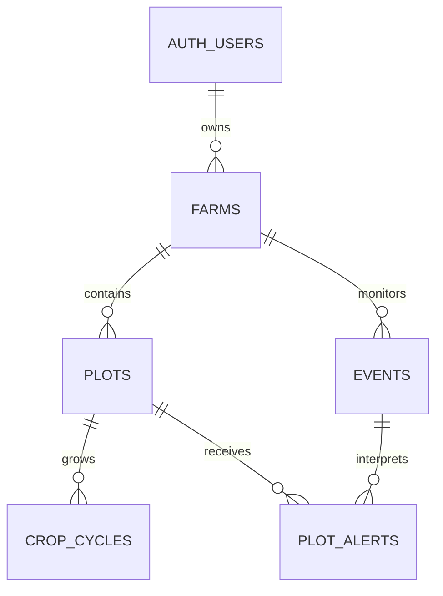

# AgroSense: MVP schema reference v1

Status: implementation reference for the confirmed **24-hour hackathon demo**.
This change defines schemas; it does not provision a database or implement routes.

Source: [AgroSense product document](https://docs.google.com/document/d/1tcxZBTNtnSFpBFIxwPe1tD6QwrSWgnngrScm1vnrx-g/edit?tab=t.0)
and the three-column sketch. Stack: [stack.md](stack.md).

## How to use this document

This is the single design reference for the five-table MVP. The column dictionary
specifies persistence; payload field tables specify JSON and API bodies. Validation
and transaction sections define behavior that depends on multiple fields or rows.
Implementation code, migrations, and fixtures belong in the build work.

## Product and scope

One seeded owner, one farm, two or three plots, maize/soybean, hazards
(frost, severe-storm, hail, extreme-heat), one forecast
adapter and one satellite basemap. Left: land, crop/stage and forecast. Center:
seeded polygons and plot selection. Right: grouped events and plot-specific risk.
Selection/filtering is local UI state. No database is required for the first
fixture-backed page; fixtures must satisfy the same DashboardResponse schema.

Keep five tables: farms → plots → crop_cycles, and farms → events → plot_alerts.
Plot alerts also reference plots. Supabase auth.users is pre-existing infrastructure.
No membership, crop catalog, rule, queue, notification, image-history, or separate
assessment-history tables. No land editor, signup flow, season-rollover UI,
weather raster overlays, regional spatial matching, or outbound messages.

## Conventions and limits

- UUIDs are server-generated. SQL snake_case maps to API camelCase unless an
  explicit projection below says otherwise. No API accepts ownership fields.
- Every listed response property is required, even when its value is null.
  Objects reject unknown keys. PATCH is the only partial object.
- SQL instants are timestamptz; API instants are RFC3339 UTC strings ending in Z.
  Projected SQL instants and freshness comparisons preserve PostgreSQL's
  microsecond precision, normalizing to six fractional digits rather than
  truncating crop-cycle change tokens to JavaScript milliseconds.
  Dates are YYYY-MM-DD. Display timezone is fixed to America/Argentina/Cordoba.
- JSON numbers are finite. Area is numeric(12,2) in SQL and a JSON number in
  hectares; serialize as a number, not a database decimal string. Values round
  to two decimal places before persistence. No field implies measured area.
- Geometry is GeoJSON Polygon with one exterior ring and no holes. Coordinates
  are exactly [longitude, latitude], with no altitude. Bounds are [-180,180] and
  [-90,90]. Ring closes with the same first/last pair, has at least three distinct
  non-collinear vertices, and must not self-intersect. Point is a two-value pair.
- Seed import validates valid topology, plot containment in the farm, sample
  point inside its plot, and no positive-area sibling overlap. Shared edges are
  allowed. Shapes cannot be edited through MVP endpoints.
- Per farm: 10 plots; 50 retained events; 5,000 total coordinate positions across
  farm/plot boundaries including repeated closing points; 1 MiB UTF-8 dashboard
  JSON. Per plot: 168 hourly forecast samples. PATCH body limit: 16 KiB.
  Exceeding a limit rejects the whole operation; never truncate land or forecasts.
- Manual refresh cooldown: 60 seconds per farm. Optional scheduled interval:
  30 minutes. Provider deadline: 8 seconds per request, at most two concurrent
  requests; total refresh deadline: 55 seconds. Optional one LLM call: 5 seconds,
  at most 500 output tokens, validated output with template fallback.
- Fresh forecast deadline: earliest of retrievedAt+60 minutes and, if known,
  issuedAt+6 hours. These are demo operating defaults, not agronomic guarantees.

## Column dictionary

Every column is listed below. “NULL” means nullable with an implicit SQL NULL
default; “required” means NOT NULL without a default. Enforce the constraints
documented below in the database where possible. created_at and updated_at
default to now(); timestamp maintenance refreshes
updated_at on every UPDATE. Only the server writes these timestamps.

### farms

| Column | SQL type | Null/default | Meaning |
| --- | --- | --- | --- |
| `id` | `uuid` | `NOT NULL; gen_random_uuid()` | Farm identity. |
| `owner_id` | `uuid` | `required` | Only user permitted to read this farm. |
| `name` | `text` | `required` | Display name, trimmed, 1–100 characters. |
| `province` | `text` | `required` | Display province, trimmed, 1–100 characters. |
| `locality` | `text` | `NULL` | Display locality, null when unknown. |
| `timezone` | `text` | `NOT NULL; 'America/Argentina/Cordoba'` | Fixed MVP display timezone. |
| `data_mode` | `text` | `NOT NULL; 'demo'` | Selects demo or live adapter; seeded, not editable through the API. |
| `boundary_geojson` | `jsonb` | `required` | Polygon schema; farm outline. |
| `declared_area_ha` | `numeric(12,2)` | `required` | Declared hectares; two decimal places, 0.01–1,000,000. |
| `data_version` | `integer` | `NOT NULL; 1` | Farm-wide compare-and-swap token for cultivation and refresh writes. |
| `custom_rules` | `jsonb` | `NOT NULL; '[]'::jsonb` | Custom user-defined RiskRule definitions for this farm (max 10). |
| `forecast_summary` | `jsonb` | `NULL` | ForecastSummary schema; null before first successful refresh. |
| `last_attempt_at` | `timestamptz` | `NULL` | Latest admitted refresh attempt time; replaced by completion time if still current. |
| `last_success_at` | `timestamptz` | `NULL` | Latest successful publication time. |
| `last_error_code` | `text` | `NULL` | Latest current refresh failure; null after success. |
| `created_at` | `timestamptz` | `NOT NULL; now()` | Creation instant. |
| `updated_at` | `timestamptz` | `NOT NULL; now()` | Most recent row update instant. |

### plots

| Column | SQL type | Null/default | Meaning |
| --- | --- | --- | --- |
| `id` | `uuid` | `NOT NULL; gen_random_uuid()` | Plot identity. |
| `farm_id` | `uuid` | `required` | Owning farm. |
| `name` | `text` | `required` | Unique case-sensitive trimmed name within this farm. |
| `boundary_geojson` | `jsonb` | `required` | Polygon schema; plot outline. |
| `sample_point_geojson` | `jsonb` | `required` | Point schema; forecast sampling location inside this plot. |
| `declared_area_ha` | `numeric(12,2)` | `required` | Declared hectares, with the same bounds as farms. |
| `created_at` | `timestamptz` | `NOT NULL; now()` | Creation instant. |
| `updated_at` | `timestamptz` | `NOT NULL; now()` | Most recent row update instant. |

### crop_cycles

| Column | SQL type | Null/default | Meaning |
| --- | --- | --- | --- |
| `id` | `uuid` | `NOT NULL; gen_random_uuid()` | Cultivation-period identity, stable when correcting current data. |
| `plot_id` | `uuid` | `required` | Owning plot. |
| `crop_code` | `text` | `required` | maize or soybean. |
| `season_label` | `text` | `required` | Display label YYYY/YY, e.g. 2026/27; seeded. |
| `sown_on` | `date` | `NULL` | Known planting date; null means unknown. |
| `stage_code` | `text` | `NULL` | Declared supported stage; null means unknown. |
| `stage_as_of` | `date` | `NULL` | Local date when the declared stage was observed. |
| `ended_on` | `date` | `NULL` | Exclusive local end date; null identifies the open cycle. Seed/admin only. |
| `created_at` | `timestamptz` | `NOT NULL; now()` | Creation instant. |
| `updated_at` | `timestamptz` | `NOT NULL; now()` | Most recent row update instant. |

### events

| Column | SQL type | Null/default | Meaning |
| --- | --- | --- | --- |
| `id` | `uuid` | `NOT NULL; gen_random_uuid()` | Stable identity retained by upsert. |
| `farm_id` | `uuid` | `required` | Farm whose forecast produced this event. |
| `source_code` | `text` | `required` | demo or open_meteo. |
| `source_event_key` | `text` | `required` | Daily identity defined in Event normalization below. |
| `kind` | `text` | `NOT NULL; 'frost'` | Hazard kind: frost, severe-storm, hail, or extreme-heat. |
| `title` | `text` | `required` | Trimmed display title, 1–160 characters. |
| `starts_at` | `timestamptz` | `required` | First qualifying hourly interval start for this daily event. |
| `ends_at` | `timestamptz` | `required` | Last qualifying hourly interval end; always present in this MVP. |
| `issued_at` | `timestamptz` | `NULL` | Actual provider issuance; null when not supplied. |
| `retrieved_at` | `timestamptz` | `required` | Time the adapter obtained the evidence. |
| `source_url` | `text` | `NULL` | HTTPS attribution link; null for synthetic data. |
| `status` | `text` | `NOT NULL; 'active'` | active or cancelled. |
| `evidence` | `jsonb` | `required` | EventEvidence schema, including all hours for that day. |
| `is_demo` | `boolean` | `required` | True exactly when source_code=demo. |
| `created_at` | `timestamptz` | `NOT NULL; now()` | Creation instant. |
| `updated_at` | `timestamptz` | `NOT NULL; now()` | Most recent row update instant. |

### plot_alerts

| Column | SQL type | Null/default | Meaning |
| --- | --- | --- | --- |
| `id` | `uuid` | `NOT NULL; gen_random_uuid()` | Stable identity retained by event/plot upsert. |
| `farm_id` | `uuid` | `required` | Owning farm, included to enforce cross-farm FK consistency. |
| `plot_id` | `uuid` | `required` | Affected plot; must belong to farm_id. |
| `event_id` | `uuid` | `required` | Source event; must belong to farm_id. |
| `assessment_state` | `text` | `required` | evaluated, insufficient_data, or no_applicable_rule. |
| `risk_level` | `text` | `NULL` | low/moderate/high/critical for evaluated; null otherwise. |
| `reason` | `text` | `required` | Trimmed explanation, 1–1,000 characters, always present. |
| `recommended_actions` | `jsonb` | `NOT NULL; '[]'::jsonb` | Array of actionable recommendations (1–10 items, 1–1,000 chars each) when evaluated; empty array otherwise. |
| `input_snapshot` | `jsonb` | `required` | InputSnapshot schema: exact inputs for this current result. |
| `rule_version` | `text` | `required` | Whole rule-set version, including when no rule applies. |
| `generated_at` | `timestamptz` | `required` | Time evaluation finished. |
| `valid_until` | `timestamptz` | `required` | Freshness deadline, strictly later than generated_at. |
| `generation_method` | `text` | `NOT NULL; 'template'` | template or llm; matches snapshot generation.method. |
| `created_at` | `timestamptz` | `NOT NULL; now()` | Creation instant. |
| `updated_at` | `timestamptz` | `NOT NULL; now()` | Most recent row update instant. |

### Keys, deletion, and write boundaries

- All five id columns are primary keys. Farm owner deletion is RESTRICT.
- plots: UNIQUE(farm_id,name), UNIQUE(id,farm_id); farm deletion RESTRICT.
- crop_cycles: plot deletion RESTRICT; partial UNIQUE(plot_id) WHERE ended_on
  IS NULL. Name/season rollover and ended_on are seed/admin operations only.
- events: UNIQUE(farm_id,source_code,source_event_key), UNIQUE(id,farm_id);
  farm deletion RESTRICT. Upserts preserve id and created_at.
- plot_alerts: UNIQUE(plot_id,event_id). Composite plot/farm and event/farm FKs
  prevent cross-farm links; plot/farm deletion RESTRICT, event deletion CASCADE
  to its current alerts. No other cascading deletion is defined.
- RLS grants authenticated users owner-scoped reads. Anonymous users have no
  access. Direct authenticated INSERT/UPDATE/DELETE is revoked for all tables.
  Service-role credentials stay server-side. Mutation RPC implementations must
  verify owner identity, validate inputs, lock the farm, and apply the version
  protocol below; no generic privileged SQL endpoint is permitted.
- SQL checks structure/version markers on JSONB; it does **not** validate the
  complete JSON shapes below, polygon topology, or cross-row JSON references.
  The trusted import/publication boundary validates those before writing.

### Database consistency checks and indexes

- data_version is a positive integer. forecast_summary is null exactly when
  last_success_at is null. A non-null last_success_at requires last_attempt_at
  and must be <= last_attempt_at.
- farms.custom_rules is a JSONB array with at most 10 items (`CHECK (jsonb_typeof(custom_rules) = 'array' AND jsonb_array_length(custom_rules) <= 10)`).
- events.kind is constrained by `CHECK (kind IN ('frost', 'severe-storm', 'hail', 'extreme-heat'))`.
- plot_alerts.risk_level is constrained by `CHECK (risk_level IN ('low', 'moderate', 'high', 'critical') OR risk_level IS NULL)`.
- plot_alerts.recommended_actions is a JSONB array (`CHECK (jsonb_typeof(recommended_actions) = 'array' AND jsonb_array_length(recommended_actions) <= 10)`).
- source_event_key length is 1–200; rule_version length is 1–100. source_url is
  null or HTTPS with at most 2,048 characters. Enforce enums and all column
  dictionary limits. JSONB objects carry schemaVersion=1 where specified.
- stage_code/stage_as_of are both null or both present. Stage must belong to the
  crop. Known stage_as_of >= sown_on; known ended_on > sown_on and > stage_as_of.
- ends_at > starts_at; known issued_at <= retrieved_at. is_demo matches the
  source code. valid_until > generated_at. evaluated has non-null risk and
  non-empty recommended_actions; other assessment states have null risk and empty recommended_actions.
- Besides indexes backing primary/unique keys, add farms(owner_id),
  crop_cycles(plot_id), events(farm_id,starts_at,id), plot_alerts(farm_id), and
  plot_alerts(event_id). These cover owner reads, joins and the timeline ordering.

## Exact enums and catalogs

| Name | Allowed values |
| --- | --- |
| DataMode | demo, live |
| SourceCode | demo, open_meteo |
| CropCode | maize, soybean |
| Maize stages | V3, V6, VT, R1 |
| Soybean stages | V2, R1, R4, R6 |
| Event kind/status | frost, severe-storm, hail, extreme-heat / active, cancelled |
| AssessmentState | evaluated, insufficient_data, no_applicable_rule |
| RiskLevel | low, moderate, high, critical |
| Generation method | template, llm |
| Monitoring status (derived) | never_refreshed, fresh, stale, failed |

These stage lists are the supported input vocabulary, not an inference of stage
from sowing date. All labels/catalog entries live in typed code. Adding supported
stages requires updating the API catalog and SQL CHECK together.

## Exact JSONB shapes

The payload field tables below specify every nested field. Presence and
nullability are separate: required nullable fields must be present with null when
unknown. Array bounds, format rules and cross-field checks are mandatory runtime
validation. Unknown object keys are rejected.

| SQL field | Schema | Fields |
| --- | --- | --- |
| farms.boundary_geojson, plots.boundary_geojson | Polygon | type=Polygon; coordinates=[one closed ring] |
| plots.sample_point_geojson | Point | type=Point; coordinates=[longitude,latitude] |
| farms.custom_rules | array of RiskRule | max 10 items; each item validates against RiskRule schema |
| farms.forecast_summary | ForecastSummary or SQL NULL | schemaVersion=1, fetchedAt, windowStart, windowEnd, plots[] |
| forecast_summary.plots[] | PlotForecast | plotId, samplePoint, source, temperatureHeightM=2, hours[] |
| events.evidence | EventEvidence | schemaVersion=1, scope, plotIds[], forecastDate, samplePoint, source, temperatureHeightM=2, detectionThresholdC, hours[] |
| plot_alerts.recommended_actions | array of string | 1–10 items when evaluated; empty array [] otherwise |
| plot_alerts.input_snapshot | InputSnapshot | schemaVersion=1, plotId, cropCycle or null, event, ruleSetVersion, matchedRuleCodes[], generation |

Source = {code, url or null, issuedAt or null, retrievedAt, isDemo}.
ForecastHour = {at, temperatureC, windGustKmh or null, precipitationMm or null, precipitationProbability or null, weatherCode or null}; at begins a one-hour interval. Temperature is
Celsius at 2 m, in [-100,70]. Wind gusts are km/h in [0,300]. Precipitation is mm/h in [0,500]. Probability is percentage [0,100]. weatherCode is an integer WMO weather code in [0,99],
null when unavailable. Missing optional measurements remain null. Missing provider temperatures invalidate a complete
refresh; they never become zero.

Additional publication checks:

1. Forecast plot IDs are unique and exactly cover this farm's plots. Each point
   equals the stored sampling point. Hours are unique, chronological, exactly one
   hour apart, UTC hour-aligned, and cover [windowStart,windowEnd) without gaps.
   All plots share that window; its length is 1–168 hours. fetchedAt is the latest
   retrievedAt among plot sources. Live requests target 168 hours; a shorter
   complete provider window is accepted and displayed as that shorter horizon.
2. Source isDemo is true exactly for demo; all rows/JSON source codes match the
   farm mode (demo→demo, live→open_meteo). Mode cannot change through the API.
   Do not silently replace failed live data with demo data. issuedAt is actual
   provider metadata, null if unavailable; if present, it cannot exceed retrievedAt.
3. EventEvidence plot IDs all belong to the event farm. farm_demo scope requires
   demo source and null samplePoint; all its plots use identical synthetic hours.
   plot_forecast requires open_meteo, exactly one plot, and its stored point.
   Hours are precisely the forecast hours on forecastDate (UTC), at most 24.
4. Event row source/timestamps/is_demo equal evidence.source; event keys and
   bounds follow normalization below. A plot alert's plot occurs in evidence.plotIds.
5. Snapshot event ID/status/bounds/evidence equal the current event at evaluation;
   snapshot plotId equals the alert plot. Snapshot cropCycle is that plot's current
   cycle or null, including its updatedAt. rule_version equals ruleSetVersion;
   generation_method equals generation.method. template has null modelId and
   promptVersion; llm requires both. Snapshot matched rule codes exist in that
   exact versioned rule set or farm custom rules.
6. evaluated requires non-null risk and non-empty recommended_actions (1–10 items).
   Other states require null risk, empty recommended_actions, and an explanatory reason. valid_until must be after generated_at.

## Event normalization and risk rules

Use one event per **UTC date, hazard kind, and source scope**. The adapter's key is exactly:

- Demo: `demo:<kind>:YYYY-MM-DD` (one shared synthetic forecast for the farm).
- Live: `open_meteo:<kind>:<plot UUID>:YYYY-MM-DD` (one forecast sampling location).

Qualifying hazard thresholds:
- `frost`: at least one hourly interval has `temperatureC <= 0°C`.
- `extreme-heat`: at least one hourly interval has `temperatureC >= 35°C`.
- `severe-storm`: at least one hourly interval has `windGustKmh >= 60` or `precipitationMm >= 25`.
- `hail`: Open-Meteo WMO weather code 96 or 99 (thunderstorm with hail).
  See the [provider variable reference](https://open-meteo.com/en/docs#hourly-weather-variables).

starts_at is the first qualifying hour; ends_at is the last qualifying hour plus one hour. These
bounds enclose the risk window, not necessarily continuous hazard conditions. Cancelled rows
retain their last active starts_at/ends_at while replacing evidence and status. Rules calculate
consecutive hours from the evidence, never from ends_at minus starts_at. Changes
to hours/bounds within the date retain the same event ID; a different date or hazard kind is a
different event.

RiskRule and RuleSet are defined in the payload field tables. The application evaluates rules
via the `RuleProvider` pattern:
1. Base system rules (e.g. `demo-v1`) are merged with `farms.custom_rules`.
2. A custom rule with the same `code` overrides the system rule of the same code.
3. The evaluation engine is a pure, deterministic function receiving the merged ruleset.

`evaluatePlotAlert` requires an explicit `event.kind`; daily evidence can be
shared by multiple hazards and cannot identify the event kind. It derives the
source freshness deadline at full timestamp precision and throws
`ExpiredForecastEvidenceError` with code `INVALID_PROVIDER_DATA` when that
deadline is not later than evaluation time. An optional `validUntil` input can
shorten this deadline but cannot extend it. Callers can supply `now` and `alertId`
to reproduce the same complete alert during replay or testing.

Evaluate the seeded open cycle only; the MVP has no scheduled crop transitions. For each rule:
match crop and stage, require declared stage_as_of <= the event's local start
date, and require its age on that date <= stageMaxAgeDays. Height must equal the
rule's height. A rule fires when at least minimumConsecutiveHours consecutive
hour intervals satisfy the rule's meteorological thresholds. Never replace 2 m readings with
crop-apex readings. No growth-stage estimation is performed.

All matching rules use the same evidence. Choose greatest risk (critical > high > moderate
> low), then lexicographically smallest rule code for ties. Save all firing codes
sorted lexicographically, the winning reason, and the winning recommended_actions array. Rule codes must
be unique within the effective rule set. State precedence:
cancelled event → no_applicable_rule; missing crop/stage or stale stage for an
otherwise matching rule → insufficient_data; no eligible/firing rule →
no_applicable_rule; otherwise evaluated. No applicable rule does not mean safe.

Use this fully synthetic initial rule set, version `demo-v1`:

| Rule code | Hazard / Crop / stage | Threshold | Consecutive hours | Stage age max | Risk |
| --- | --- | --- | --- | --- | --- |
| demo-maize-v3 | frost / maize / V3 | -1°C at 2 m | 1 | 14 days | moderate |
| demo-maize-v6 | frost / maize / V6 | -1°C at 2 m | 1 | 14 days | high |
| demo-soybean-r4 | frost / soybean / R4 | -1°C at 2 m | 1 | 14 days | high |
| demo-maize-heat | extreme-heat / maize / VT | 35°C at 2 m | 2 | 14 days | critical |
| demo-storm-v | severe-storm / maize / V6 | wind >= 70 km/h | 1 | 14 days | high |

All synthetic rules have reviewState=synthetic and evidenceUrl=null. Use reasonTemplate
`Escenario sintético: la regla {code} coincide.` and recommendedActionsTemplates
`["Demostración: revisar el lote; no es asesoramiento agronómico."]`. Substitute only
{code}. Other supported stages have no demo rule. These values demonstrate UI differentiation and are **not validated
agronomic thresholds**. Live evaluation permits approved rules with evidence URLs
only; if none exist, live events appear with no_applicable_rule, empty recommended_actions, and null risk.

The default generation method is template. Optional LLM rewriting accepts only
{reason,recommendedActions} with the same limits, cannot change risk, and
falls back to the template on timeout/invalid output.

## Refresh transaction protocol

POST refresh has no body; the farm's stored mode selects the adapter. One bounded
refresh does all work; there are no job IDs, 202 responses, or asynchronous queues.

1. Verify the bearer identity and farm ownership. In a short transaction lock
   the farm. If last_attempt_at is less than 60 seconds ago return 429; otherwise
   set it to attemptStartedAt and capture data_version. Commit this admission.
2. Fetch/validate the complete forecast outside a transaction, preserving actual
   provider issuance (nullable), and compute events/alerts. Failure of any plot
   rejects the whole refresh. Do not call providers or the LLM under a DB lock.
3. Open a new transaction and lock the farm. Require both the captured version
   and last_attempt_at=attemptStartedAt; otherwise rollback with 409. For each
   plot, when both prior/new provider issuance are known, reject a lower new value
   with 409 STALE_PROVIDER_DATA. With unknown issuance, ordering protection is
   the farm version/attempt check, not a claim about provider internal ordering.
4. Upsert events by their unique key and current alerts by (plot_id,event_id),
   preserving IDs/created_at. Reconcile only the complete supplied date/location
   coverage. Cancel an existing upcoming/ongoing event only if its **whole prior
   interval** is covered by newer evidence with no qualifying hours. Replace its
    alert with no_applicable_rule, reason `Forecast withdrawn by newer data.`,
    null risk/empty recommended_actions and the updated evidence. A partial window never
   cancels an event it cannot fully evaluate. Preserve recent/unaffected rows.
5. Remove events whose ends_at <= publication time minus seven days, cascading
   their current alerts. Validate retained counts, relationships and payload
   limits before commit. Store forecast_summary, set last_success_at and
   last_attempt_at to publication time, clear last_error_code, increment
   data_version by one, and commit all results together.
6. On a failure, preserve prior forecast/event/alert rows. Record the mapped
   last_error_code and completion time only if the original version and attempt
   marker still match. Version/older-provider conflicts do not set a provider
   failure code. A later refresh is the retry mechanism; a crashed attempt may
   remain admitted until the cooldown expires. No guaranteed completion is promised.

valid_until is the minimum applicable source freshness deadline for the event;
if it is already <= generated_at, reject the refresh as INVALID_PROVIDER_DATA.
Incomplete evaluations use the same still-future deadline. No alert is made fresh
merely by rewriting its retrieval time. Refreshing identical data preserves row
IDs and counts but increments the farm publication version.

## HTTP contracts and response derivation

All paths require `Authorization: Bearer <Supabase access token>`. Local fixtures
may bypass auth only in an explicitly local demo mode. Responses use
`Cache-Control: private, no-store`. Query parameters are unsupported in v1.
Exact body fields are defined below; the three operations are:

| Method/path | Input | Success |
| --- | --- | --- |
| GET /api/farms/:farmId/dashboard | UUID path; no body/query | 200 DashboardResponse |
| POST /api/farms/:farmId/refresh | UUID path; no body/query | 200 RefreshResponse after commit |
| PATCH /api/farms/:farmId/plots/:plotId/crop-cycle | UpdateCropCycleRequest | 200 UpdateCropCycleResponse |

PATCH requires expectedDataVersion plus at least one of cropCode, sownOn,
stageCode, stageAsOf. Omission preserves a value; null clears only nullable values.
Supplying either stage field requires both. If cropCode changes, both stage fields
must be supplied with a compatible stage/date or both null. Merge with the open
cycle, then validate: known sowing and stage dates cannot be in the future in the
farm timezone; stage date cannot precede sowing. No active cycle returns 404;
there is no implicit insertion. Reject endedOn, seasonLabel, ownership and unknown
fields. Under the farm lock, check the expected version, save the cycle and
increment data_version atomically. Even a valid no-op PATCH increments the version.
Existing risk becomes stale by the changed crop-cycle updatedAt; no automatic
refresh is initiated. The client invokes refresh and then reloads the dashboard.

DashboardResponse contains exactly schemaVersion, asOf, farm, plots, basemap,
forecast, events, monitoring. Read all DB data under one consistent snapshot.

- Farm omits owner_id and internal timestamps; boundary_geojson becomes boundary;
  custom_rules becomes customRules.
  Plot omits farm_id; includes samplePoint and activeCropCycle or null. CropCycle
  exposes updatedAt for context comparison; created_at is not a public field.
- forecast is the stored ForecastSummary, including per-plot source and hourly
  data; null before success. No generated satellite bytes are included.
- EventCard includes source from its row/evidence, evidence, and alerts for its
  plot IDs. PlotAlert exposes all current evaluation data except farm_id and DB
  created_at/updated_at; inputSnapshot provides the evidence; recommended_actions becomes
  recommendedActions. source_event_key remains an internal ingestion key.
- temporalState: upcoming if asOf < startsAt; ongoing if startsAt <= asOf < endsAt;
  recent otherwise. Sort ongoing first, then upcoming, then recent; each of the
  first two groups uses startsAt ascending, recent descending; UUID ascending
  breaks ties. Cancelled cards keep that time grouping and a cancelled label.
- Only active, non-recent, non-stale evaluated alerts contribute to current risk.
  isStale is true when asOf >= validUntil, current rule-set version differs, or
  the snapshot's crop-cycle ID/updatedAt differs from the current open cycle
  (including null/non-null changes). Keep the old values visible as stale evidence;
  they must not drive current recommended actions. Cancelled risk never drives action.
- Monitoring status precedence: non-null lastErrorCode → failed; null forecast →
  never_refreshed; expired forecast deadline or any stale non-recent active alert
  → stale; otherwise fresh. forecastValidUntil is the minimum deadline across
  forecast plot sources, or null. “fresh with zero events” means a successful
  empty hazard result; it is distinct from missing/failed data.
- Basemap is either available with HTTPS tileUrlTemplate, attribution, zoom bounds
  and nullable acquiredAt, or unavailable with reason. Available templates must
  include {z}, {x}, {y}; minZoom <= maxZoom; credentials must be browser-safe.
  Provider selection remains deployment configuration; report unavailable until
  a working tile service is configured.

| HTTP | Error code and condition |
| --- | --- |
| 400 | BAD_REQUEST: malformed JSON/UUID, unsupported query/body, unknown key |
| 401 | UNAUTHENTICATED: absent/invalid identity |
| 404 | NOT_FOUND: absent or inaccessible farm/plot/open cycle |
| 409 | VERSION_CONFLICT: concurrent edit/refresh; STALE_PROVIDER_DATA: older known issuance |
| 413 | PAYLOAD_LIMIT_EXCEEDED: request/dataset/response exceeds a documented limit |
| 422 | VALIDATION_ERROR: well-formed but invalid field or merged cultivation state |
| 429 | RATE_LIMITED: farm refresh cooldown; Retry-After is remaining whole seconds, rounded up |
| 503 | REFRESH_UNAVAILABLE: provider timeout/unavailable/invalid data; retain old snapshot |
| 500 | INTERNAL_ERROR: unexpected storage/runtime failure, with no private details |

Refresh failure mapping: timeout→PROVIDER_TIMEOUT; provider HTTP/connection
failure→PROVIDER_UNAVAILABLE; schema/coverage/freshness failure→INVALID_PROVIDER_DATA;
size/count failure→PAYLOAD_LIMIT_EXCEEDED; unexpected commit failure→PUBLISH_FAILED.
Version and rate-limit conflicts do not replace last_error_code.

## Implementation and verification

Build order: fixture page → deterministic risk comparison → five-table persistence
and owner-scoped access → one live forecast adapter/manual refresh → optional
schedule and grounded AI wording. Keep shared Zod contracts browser-safe and
mirror these documented shapes; no dependency on application code from contracts.

Required implementation tests: crop-specific differences; unknown stage; mismatch
between crop/stage; invalid dates; event identity under a revised forecast; failed
partial refresh preserving results; older concurrent refresh rejected; event
cancellation clearing current risk; cross-owner/cross-farm denial; limits and
freshness derivations. Run pnpm check after application changes, and inspect the
three panels in a browser. This document is a reference, not completed runtime code.

### Implemented weather adapter

The weather adapter slice exposes only `fetchOpenMeteoPlotForecast` and
`detectThreatEvents`. Fetch performs one request with an eight-second deadline
including body consumption; failures propagate. Detection returns event identity,
kind, title, bounds, and evidence; source metadata remains in `evidence.source`.
The shared forecast and evidence contracts are also used by dashboard reads.
The adapter returns data without storing it or assigning crop risk. Refresh HTTP
routes, farm-wide aggregation/publication, and demo generation belong to their
consuming slices. SMN integration, automatic retries, and live-to-demo fallback
are outside this slice. Missing wind, rain, probability, or weather-code values
remain null; invalid temperatures or incomplete hourly coverage reject the fetch.

A real farmer pilot requires reviewed agronomic rules and provider permissions
plus monitoring reliability, history and notification design beyond this MVP.

## Payload field reference

These are data shapes, not additional database tables. Every field is required
unless its Presence column says optional. Null is permitted only when listed in
Type. A dash means no additional field-specific constraint; named types retain
their shared constraints. All objects reject unknown fields. Named types refer to other tables in
this section or to the enum catalog. Id is a UUID string; Instant is an RFC3339
UTC string ending Z; LocalDate is a valid YYYY-MM-DD date. Position is the
longitude/latitude pair defined under Conventions and limits. StageCode is the
union of supported stages, constrained by crop. EventStatus and AssessmentState
use the enum catalog. RefreshErrorCode uses the five refresh failure codes above.

Additional conditional validation:

- CropCycle.stageCode must match cropCode. stageCode/stageAsOf are both null or
  both non-null. Source.isDemo is true exactly for code=demo.
- EventEvidence.scope=farm_demo requires demo source and null samplePoint;
  plot_forecast requires open_meteo, exactly one plot ID and non-null samplePoint.
- Generation.method=template requires null modelId/promptVersion; llm requires
  both. PlotAlert.evaluated requires riskLevel and non-empty recommendedActions (1–10 items);
  other states require null riskLevel and empty recommendedActions.
- Basemap uses exactly one of the two alternatives below. Available templates
  require {z}, {x}, {y} and minZoom <= maxZoom.
- RiskRule stages must belong to its crop. Approved rules require a non-null
  HTTPS evidenceUrl. Rule codes must be unique within RuleSet.
- PATCH requires at least one cultivation field, and the stage pair/merge rules
  in the HTTP section apply even though its fields are individually optional.

### Point

| Field | Type | Presence | Validation |
| --- | --- | --- | --- |
| type | Point (constant) | required | — |
| coordinates | Position | required | — |

### Polygon

| Field | Type | Presence | Validation |
| --- | --- | --- | --- |
| type | Polygon (constant) | required | — |
| coordinates | array of array of Position | required | 1–1 items; each item: 4–5000 items; each item: — |

### Source

| Field | Type | Presence | Validation |
| --- | --- | --- | --- |
| code | SourceCode | required | — |
| url | text or null | required | 0–2048 characters; uri; HTTPS only; — |
| issuedAt | Instant or null | required | —; — |
| retrievedAt | Instant | required | — |
| isDemo | boolean | required | — |

### ForecastHour

| Field | Type | Presence | Validation |
| --- | --- | --- | --- |
| at | Instant | required | — |
| temperatureC | number | required | -100–70 |
| windGustKmh | number or null | required | 0–300; — |
| precipitationMm | number or null | required | 0–500; — |
| precipitationProbability | integer or null | required | 0–100; — |
| weatherCode | integer or null | required | WMO weather code, 0–99; null when unavailable |

### PlotForecast

| Field | Type | Presence | Validation |
| --- | --- | --- | --- |
| plotId | Id | required | — |
| samplePoint | Point | required | — |
| source | Source | required | — |
| temperatureHeightM | 2 (constant) | required | — |
| hours | array of ForecastHour | required | 1–168 items; each item: — |

### ForecastSummary

| Field | Type | Presence | Validation |
| --- | --- | --- | --- |
| schemaVersion | 1 (constant) | required | — |
| fetchedAt | Instant | required | — |
| windowStart | Instant | required | — |
| windowEnd | Instant | required | — |
| plots | array of PlotForecast | required | 1–10 items; each item: — |

### CropCycle

| Field | Type | Presence | Validation |
| --- | --- | --- | --- |
| id | Id | required | — |
| plotId | Id | required | — |
| cropCode | CropCode | required | — |
| seasonLabel | text | required | YYYY/YY |
| sownOn | LocalDate or null | required | —; — |
| stageCode | StageCode or null | required | —; — |
| stageAsOf | LocalDate or null | required | —; — |
| endedOn | LocalDate or null | required | —; — |
| updatedAt | Instant | required | — |

### EventEvidence

| Field | Type | Presence | Validation |
| --- | --- | --- | --- |
| schemaVersion | 1 (constant) | required | — |
| scope | farm_demo, plot_forecast | required | — |
| plotIds | array of Id | required | 1–10 items; unique values; each item: — |
| forecastDate | LocalDate | required | — |
| samplePoint | Point or null | required | —; — |
| source | Source | required | — |
| temperatureHeightM | 2 (constant) | required | — |
| detectionThresholdC | number or null | required | 0 for frost; 35 for extreme-heat; null for severe-storm/hail |
| hours | array of ForecastHour | required | 1–24 items; each item: — |

### EventSnapshot

| Field | Type | Presence | Validation |
| --- | --- | --- | --- |
| id | Id | required | — |
| status | EventStatus | required | — |
| startsAt | Instant | required | — |
| endsAt | Instant | required | — |
| evidence | EventEvidence | required | — |

### Generation

| Field | Type | Presence | Validation |
| --- | --- | --- | --- |
| method | template, llm | required | — |
| modelId | text or null | required | 1–200 characters; — |
| promptVersion | text or null | required | 1–100 characters; — |

### InputSnapshot

| Field | Type | Presence | Validation |
| --- | --- | --- | --- |
| schemaVersion | 1 (constant) | required | — |
| plotId | Id | required | — |
| cropCycle | CropCycle or null | required | —; — |
| event | EventSnapshot | required | — |
| ruleSetVersion | text | required | 1–100 characters |
| matchedRuleCodes | array of text | required | 0–20 items; unique values; each item: 1–100 characters |
| generation | Generation | required | — |

### PlotAlert

| Field | Type | Presence | Validation |
| --- | --- | --- | --- |
| id | Id | required | — |
| plotId | Id | required | — |
| eventId | Id | required | — |
| assessmentState | AssessmentState | required | — |
| riskLevel | RiskLevel or null | required | —; — |
| reason | text | required | 1–1000 characters |
| recommendedActions | array of text | required | 0–10 items; each item: 1–1000 characters |
| ruleVersion | text | required | 1–100 characters |
| generatedAt | Instant | required | — |
| validUntil | Instant | required | — |
| generationMethod | template, llm | required | — |
| inputSnapshot | InputSnapshot | required | — |
| isStale | boolean | required | — |

### Farm

| Field | Type | Presence | Validation |
| --- | --- | --- | --- |
| id | Id | required | — |
| name | text | required | 1–100 characters |
| province | text | required | 1–100 characters |
| locality | text or null | required | 1–100 characters; — |
| timezone | America/Argentina/Cordoba | required | — |
| dataMode | DataMode | required | — |
| boundary | Polygon | required | — |
| declaredAreaHa | number | required | 0.01–1000000 |
| dataVersion | integer | required | 1–2147483647 |
| customRules | array of RiskRule | required | 0–10 items |

### Plot

| Field | Type | Presence | Validation |
| --- | --- | --- | --- |
| id | Id | required | — |
| name | text | required | 1–100 characters |
| boundary | Polygon | required | — |
| samplePoint | Point | required | — |
| declaredAreaHa | number | required | 0.01–1000000 |
| activeCropCycle | CropCycle or null | required | —; — |

### Basemap — available

| Field | Type | Presence | Validation |
| --- | --- | --- | --- |
| status | available | required | — |
| tileUrlTemplate | text | required | 1–2048 characters; HTTPS only |
| attribution | text | required | 1–500 characters |
| minZoom | integer | required | 0–24 |
| maxZoom | integer | required | 0–24 |
| acquiredAt | Instant or null | required | —; — |

### Basemap — unavailable

| Field | Type | Presence | Validation |
| --- | --- | --- | --- |
| status | unavailable | required | — |
| reason | text | required | 1–300 characters |

### EventCard

| Field | Type | Presence | Validation |
| --- | --- | --- | --- |
| id | Id | required | — |
| kind | EventKind | required | frost, severe-storm, hail, extreme-heat |
| title | text | required | 1–160 characters |
| startsAt | Instant | required | — |
| endsAt | Instant | required | — |
| status | EventStatus | required | — |
| temporalState | upcoming, ongoing, recent | required | — |
| source | Source | required | — |
| evidence | EventEvidence | required | — |
| alerts | array of PlotAlert | required | 0–10 items; each item: — |

### Monitoring

| Field | Type | Presence | Validation |
| --- | --- | --- | --- |
| status | never_refreshed, fresh, stale, failed | required | — |
| lastAttemptAt | Instant or null | required | —; — |
| lastSuccessAt | Instant or null | required | —; — |
| lastErrorCode | RefreshErrorCode or null | required | —; — |
| forecastValidUntil | Instant or null | required | —; — |

### DashboardResponse

| Field | Type | Presence | Validation |
| --- | --- | --- | --- |
| schemaVersion | 1 (constant) | required | — |
| asOf | Instant | required | — |
| farm | Farm | required | — |
| plots | array of Plot | required | 0–10 items; each item: — |
| basemap | Basemap | required | — |
| forecast | ForecastSummary or null | required | —; — |
| events | array of EventCard | required | 0–50 items; each item: — |
| monitoring | Monitoring | required | — |

### RefreshResponse

| Field | Type | Presence | Validation |
| --- | --- | --- | --- |
| farmId | Id | required | — |
| dataVersion | integer | required | 1–2147483647 |
| refreshedAt | Instant | required | — |
| dataMode | DataMode | required | — |
| eventCount | integer | required | 0–50 |
| alertCount | integer | required | 0–500 |

### UpdateCropCycleRequest

| Field | Type | Presence | Validation |
| --- | --- | --- | --- |
| expectedDataVersion | integer | required | 1–2147483647 |
| cropCode | CropCode | optional | — |
| sownOn | LocalDate or null | optional | —; — |
| stageCode | StageCode or null | optional | —; — |
| stageAsOf | LocalDate or null | optional | —; — |

### UpdateCropCycleResponse

| Field | Type | Presence | Validation |
| --- | --- | --- | --- |
| farmId | Id | required | — |
| dataVersion | integer | required | 1–2147483647 |
| cropCycle | CropCycle | required | — |

### ErrorResponse

| Field | Type | Presence | Validation |
| --- | --- | --- | --- |
| error | ErrorBody | required | — |

### RiskRule

| Field | Type | Presence | Validation |
| --- | --- | --- | --- |
| code | text | required | 1–100 characters |
| hazardKind | EventKind | required | frost, severe-storm, hail, extreme-heat |
| cropCode | CropCode | required | — |
| stageCodes | array of StageCode | required | 1–8 items; unique values; each item: — |
| temperatureHeightM | 2 (constant) | required | — |
| thresholdC | number or null | required | -100–70; — |
| windGustThresholdKmh | number or null | required | 0–300; — |
| precipitationThresholdMm | number or null | required | 0–500; — |
| minimumConsecutiveHours | integer | required | 1–24 |
| stageMaxAgeDays | integer | required | 1–30 |
| riskLevel | RiskLevel | required | low, moderate, high, critical |
| reviewState | synthetic, approved | required | — |
| evidenceUrl | text or null | required | 0–2048 characters; uri; HTTPS only; — |
| reasonTemplate | text | required | 1–1000 characters |
| recommendedActionTemplates | array of text | required | 1–10 items; each item: 1–1000 characters |

### RuleSet

| Field | Type | Presence | Validation |
| --- | --- | --- | --- |
| version | text | required | 1–100 characters |
| rules | array of RiskRule | required | 0–20 items; each item: — |

### FieldError

| Field | Type | Presence | Validation |
| --- | --- | --- | --- |
| path | text | required | 1–200 characters |
| message | text | required | 1–300 characters |

### ErrorBody

| Field | Type | Presence | Validation |
| --- | --- | --- | --- |
| code | BAD_REQUEST, UNAUTHENTICATED, NOT_FOUND, VERSION_CONFLICT, STALE_PROVIDER_DATA, PAYLOAD_LIMIT_EXCEEDED, VALIDATION_ERROR, RATE_LIMITED, REFRESH_UNAVAILABLE, INTERNAL_ERROR | required | — |
| message | text | required | 1–300 characters |
| details | array of FieldError | optional | 0–20 items; each item: — |
