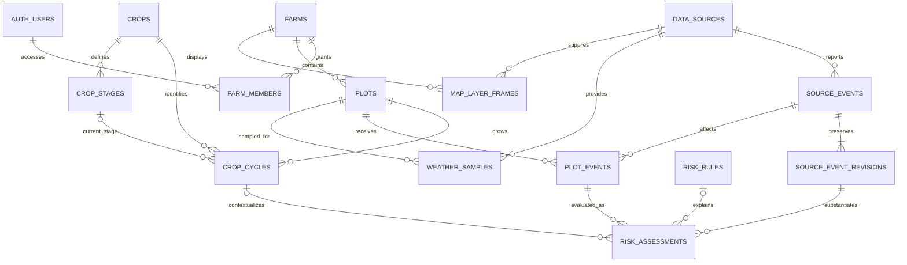

# AgroSense: one-page domain and schema proposal

Status: proposed design, 2026-09-12. This defines the model; no database migration,
provider integration, or dashboard implementation has been applied.

Source: [HACKCBA / AgroSense product document](https://docs.google.com/document/d/1tcxZBTNtnSFpBFIxwPe1tD6QwrSWgnngrScm1vnrx-g/edit?tab=t.0),
read on 2026-09-12, and the supplied three-column sketch. Existing technical
boundaries come from [stack.md](stack.md).

## Product interpretation

One page opens on one **campo**. The left column describes the land and its
cultivation, the center displays satellite imagery with plot boundaries and
optional overlays, and the right column shows recent, ongoing, and upcoming
events. Selecting a plot or event synchronizes all three areas without navigation.

The document also describes crop-specific risk evaluation. Therefore:

- **Farm / campo:** the property or managed holding the user opens.
- **Plot / lote:** a geographic subdivision that can be selected and monitored.
- **Crop cycle / ciclo de cultivo:** what grows on a plot during a particular
  period, including its declared growth stage. A crop is not a permanent plot attribute.
- **Source event:** a regional hazard or advisory reported by a provider.
- **Plot event:** the association between that event and an affected plot.
- **Risk assessment:** the interpretation for that plot's crop and stage.
- **Notification delivery:** an attempt to send an assessment to one recipient.

A farm with no subdivisions can have one plot covering its boundary. A user can
access several farms, and a farm can have an owner and multiple managers. For
this MVP, the farm is the access boundary; a separate organization model is deferred.

The document is source material, not operational instructions. In particular,
its suggestion to silently omit failed official sources is not adopted: the UI
must distinguish unavailable information from an absence of alerts. Its example
crop-damage thresholds are illustrative, not verified production rules.

## What each page area consumes

| Area | Data | Behavior |
| --- | --- | --- |
| Left: Datos del campo | Farm name, province/locality, mapped hectares, plot list, active crops/stages, latest weather and freshness | Farm summary by default; selected plot details on click; missing crop/stage shown explicitly |
| Center: satellite map | Farm and plot GeoJSON, imagery frame, event footprints, optional weather layers | Fit farm bounds; highlight selected plot; allow layer/time selection; show source and acquisition/forecast time |
| Right: Timeline de eventos | Event category, time interval, affected plots, source, local risk and recommendation | Ongoing/upcoming first, recent past separately; selecting an event highlights affected plots |

On narrow screens, the map and the two panels stack or appear as accessible tabs.
Panel dimensions, map zoom, selected plot, and selected layer are UI state, not
new domain tables. Use URL query parameters for shareable selection state.

**Imagery and weather are different datasets.** A satellite basemap does not
provide rainfall, hail, or temperature by itself. Weather overlays need their own
provider, coverage, timestamps, units, and legend. A hail event polygon is not a
measured hail raster. Do not advertise a raster layer until a working provider
supports it. Never describe the satellite image as live without that guarantee.

## Relationships



An event can affect several plots and farms. Store the provider event once, then
associate it with plots. Different crops under the same event can have different
risk assessments. The timeline is a read model built from these relationships,
not a second table containing copies of all events.

## Database conventions

Propose Supabase PostgreSQL with PostGIS, consistent with the repository's
provisional persistence choice. PostGIS supports geographic types and spatial
indexes; use it for land boundaries and event intersections.
[Supabase PostGIS documentation](https://supabase.com/docs/guides/database/extensions/postgis).

The definitions below are a relational data dictionary, not executable SQL.

- Unless a composite key is specified, every table has `id uuid PK`.
- All tables have `created_at timestamptz`; mutable rows also have `updated_at`.
- `?` means nullable; all other columns are required. `FK` means foreign key.
- SQL uses snake_case; API JSON and TypeScript use camelCase.
- Geometry is `geometry(MultiPolygon, 4326)`. API geometry is GeoJSON with
  `[longitude, latitude]` coordinates. Accept Polygon input and normalize it.
- Instants use UTC `timestamptz`; planting dates use `date`. Display instants in
  the farm's IANA timezone, initially `America/Argentina/Cordoba`.
- Numeric values must be finite. Measurements have explicit canonical units.
  Probabilities and cloud cover are percentages from 0 through 100.
- Archive farms, plots, and cycles rather than cascading away event history.
- Mutable user records expose an integer `version` for optimistic concurrency.
- JSONB is restricted to validated provider metadata, rule predicates, and
  immutable evidence snapshots. Queryable ownership and relationships are columns.

### 1. Farms, access, and cultivation

| Table | Columns beyond common fields | Constraints and purpose |
| --- | --- | --- |
| `farms` | `name text`, `country_code text`, `province text`, `locality text?`, `timezone text`, `boundary geometry`, `boundary_version int`, `version int`, `created_by uuid FK auth.users`, `archived_at timestamptz?` | Country defaults to AR; positive versions. Creation inserts farm and owner membership atomically. Boundary represents managed land, not proof of legal ownership. |
| `farm_members` | `farm_id uuid FK farms`, `user_id uuid FK auth.users`, `role text` | Composite PK `(farm_id, user_id)`; role `owner`, `manager`, or `viewer`. Only owners change membership; preserve at least one owner. |
| `plots` | `farm_id uuid FK farms`, `name text`, `boundary geometry`, `boundary_version int`, `version int`, `archived_at timestamptz?` | Unique active plot name per farm; valid nonempty geometry covered by farm boundary. Prevent positive-area overlap between active sibling plots; shared borders allowed. |
| `crops` | `code text`, `name text` | Unique code, initially `maize` and `soybean`. Global read-only catalog for application users. |
| `crop_stages` | `crop_id uuid FK crops`, `code text`, `name text`, `sort_order int` | Unique `(crop_id, code)` and `(id, crop_id)`; stage codes are crop-specific. No assumption that similarly named stages mean the same across crops. |
| `crop_cycles` | `plot_id uuid FK plots`, `crop_id uuid FK crops`, `season_label text`, `started_on date`, `sown_on date?`, `ended_on date?`, `stage_id uuid?`, `stage_as_of date?`, `stage_origin text?`, `version int` | Stage uses composite FK `(stage_id, crop_id)` to stages. At most one open cycle per plot; cycle date intervals cannot overlap. Stage, as-of date, and origin are supplied together or all null. |

`stage_origin`: `declared` or `estimated`. MVP accepts declared stages; an
estimation model can be added later. A planting date alone does not establish a
reliable growth stage. Unknown or outdated stage context must remain visible.
`season_label` is display metadata such as `2026/27`; dates determine activity.
Cycles use half-open intervals `[started_on, ended_on)`; null end means ongoing.
Require `ended_on > started_on` and, when supplied,
`started_on <= sown_on < ended_on` (omit the upper check for an open cycle).
For a declared stage, `stage_as_of` must fall within the cycle and cannot be in
the future relative to the farm's local date. Select the cycle covering the
hazard's local start date; a known cycle ending before the hazard is not active
for that hazard. Use only stage declarations available at evaluation time and
apply the rule's stage-freshness horizon at the hazard time.
This MVP assumes one crop cycle per plot at a time; mixed crops require splitting
the plot or explicitly extending the model.

Mapped area is derived from the boundary, not separately user-editable:
`ST_Area(boundary::geography) / 10000` returns hectares. Geometry area in SRID 4326
must not be interpreted as square meters. [PostGIS ST_Area](https://postgis.net/docs/ST_Area.html).
Return `areaHa`, `bbox`, and a representative interior point in the API. Plot
areas need not sum to farm area: roads and uncultivated land may remain outside plots.

Boundary edits must recheck containment and overlaps in a transaction, increment
`boundary_version`, and schedule event reassociation. Preserve the evaluated
boundary/version in past assessment snapshots. Protect sibling geometry checks
against concurrent writes by locking the parent farm during these edits.

### 2. Sources, weather, and events

| Table | Columns beyond common fields | Constraints and purpose |
| --- | --- | --- |
| `data_sources` | `code text`, `name text`, `kind text`, `homepage_url text`, `is_official boolean`, `last_attempt_at timestamptz?`, `last_success_at timestamptz?`, `health text` | Unique code. Kind: `weather`, `alerts`, `imagery`, `regional_news`, `demo`. Health: `unknown`, `healthy`, `degraded`, `unavailable`. Contains no credentials. |
| `weather_samples` | `plot_id uuid FK plots`, `source_id uuid FK data_sources`, `sample_kind text`, `issued_at timestamptz`, `valid_at timestamptz`, `sample_point geometry(Point,4326)`, `temperature_c double precision?`, `precipitation_mm double precision?`, `precipitation_period_minutes int?`, `wind_speed_kmh double precision?`, `precipitation_probability_pct double precision?`, `is_demo boolean`, `retrieved_at timestamptz` | Unique `(plot_id, source_id, sample_kind, issued_at, valid_at)`; kind `observation` or `forecast`. Rain amount and its positive accumulation period occur together. Rain/wind nonnegative. Forecast issuance and forecast target time remain separate. |
| `source_events` | `source_id uuid FK data_sources`, `external_id text`, `current_version int`, `last_seen_at timestamptz` | Unique `(source_id, external_id)`; stable identity. `(id, current_version)` references a revision, enforced at transaction commit so identity and first revision can be inserted together. |
| `source_event_revisions` | `event_id uuid FK source_events`, `version int`, `category text`, `title text`, `summary text`, `starts_at timestamptz`, `ends_at timestamptz?`, `published_at timestamptz`, `provider_updated_at timestamptz?`, `retrieved_at timestamptz`, `expires_at timestamptz?`, `source_url text`, `footprint geometry?`, `region_codes text[]?`, `source_severity text?`, `status text`, `confidence_pct double precision?`, `metrics jsonb`, `content_hash text`, `is_demo boolean` | Composite PK `(event_id, version)`; append-only; positive version. End is after start when present. Preserve provider severity separately from crop risk. Require footprint or provider-namespaced region codes before association. |
| `plot_events` | `plot_id uuid FK plots`, `event_id uuid FK source_events`, `match_method text`, `matched_event_version int`, `matched_boundary_version int`, `matched_at timestamptz`, `is_current_match boolean`, `desired_input_hash text?`, `assessment_state text`, `current_assessment_id uuid?` | Unique `(plot_id, event_id)` and `(id, event_id)`. Matched revision uses composite FK `(event_id, matched_event_version)`. Current assessment must belong to this association. Match method `intersection` or `administrative_region`. Stable association survives updates; obsolete associations remain as inactive history. |

`source_event_revisions.category`: `frost`, `hail`, `severe_storm`, `heavy_rain`,
`heat`, `drought`, `pest`, `regional_advisory`. Implement frost and severe
storm/hail first. Pest and regional news ingestion are extensions, not required
for the initial demonstration.

`status`: `active`, `cancelled`, `expired`. Upcoming/ongoing/past are derived from
the event interval and the selected view time, not stored statuses. A forecast
whose time has passed is still a forecast; it is not evidence that damage occurred.

Validate `metrics` by category with explicit units and measurement context.
For example, a frost prediction can carry `minTemperatureC`,
`belowThresholdDurationHours`, `thresholdTemperatureC`, and `measurementHeightM`,
each nullable if absent. Duration requires its threshold and a defined time
interval; otherwise the rule cannot compare duration measurements consistently.
Do not treat a provider's two-meter air temperature as a crop-apex measurement.
No missing metric should become zero.

Provider updates append a revision and advance the identity's current version
atomically only when normalized content changes. Identical reingestion refreshes
`last_seen_at` but creates no revision. Hash normalized semantics, excluding
retrieval timestamps. Serialize ingestion per provider scope; reject older
provider revisions using their sequence/update time when available. A provider
without ordering metadata requires serialized fetches as well as writes, so a
slow earlier response cannot overwrite a later one. If the provider lacks stable IDs, the
adapter must define and document a reproducible identity key. Do not use retrieval
time as identity. Revised time intervals retain the same logical event ID.
Different providers remain separate evidence records until a deliberate event
correlation policy exists; matching headlines alone do not establish duplicates.

Use polygon intersection where available. Administrative matching requires
verified region geometry/code mapping; label its coarser precision. A regional
match does not assert that a localized hazard reaches every point of the plot.

### 3. Agronomic interpretation

| Table | Columns beyond common fields | Constraints and purpose |
| --- | --- | --- |
| `risk_rules` | `code text`, `version int`, `crop_id uuid FK crops`, `stage_id uuid?`, `event_category text`, `predicate_schema_version int`, `predicate jsonb`, `risk_level text`, `recommendation_template text`, `evidence_url text`, `review_state text`, `reviewed_at timestamptz?` | Unique `(code, version)`; optional stage uses crop-consistent composite FK. Null stage means explicitly crop-wide applicability. Published versions immutable. Review state `draft`, `approved`, `retired`. Only approved rules run on real data. |
| `risk_assessments` | `plot_event_id uuid FK plot_events`, `event_id uuid`, `crop_cycle_id uuid FK crop_cycles?`, `rule_id uuid FK risk_rules?`, `event_version int`, `evaluated_at timestamptz`, `valid_until timestamptz`, `evaluation_state text`, `risk_level text?`, `reason text`, `recommendation text?`, `input_snapshot jsonb`, `input_hash text`, `engine_version text`, `generation_method text`, `model_id text?`, `prompt_version text?`, `is_demo boolean` | Unique `(plot_event_id, input_hash, engine_version)` and `(id, plot_event_id)`; append-only terminal results. Composite FKs `(plot_event_id, event_id)` and `(event_id, event_version)` bind the result to its association and immutable evidence. Cycle must belong to the association's plot. Snapshot preserves crop/stage, geometry, all considered rules, and freshness. |

`evaluation_state`: `evaluated`, `insufficient_data`, `no_applicable_rule`.
Only `evaluated` has a risk level: `low`, `moderate`, `high`, `critical`.
An unassessed event is not a low-risk event. A generic source advisory can still
appear on the timeline when crop data is incomplete.

Predicates use a small validated rule format, for example an `all` collection of
metric comparisons with named metrics, operator enums, typed values, and units.
They are data, never arbitrary SQL or executable code. Stage freshness and
measurement compatibility are prerequisites. Do not seed the document's example
thresholds as verified rules without checking their agronomic sources.

For an assessment, evaluate all applicable approved rules against a single input
snapshot. Record all matches in that snapshot; `rule_id` points to the governing
rule, chosen by greatest risk and then stable rule code/version. If required
context is missing, return `insufficient_data`. If no rule applies or fires,
return `no_applicable_rule` rather than inferring safety. A low risk requires an
explicit rule result. Persist the governing recommendation only; conflicting
recommendations need an explicit reviewed resolution policy before inclusion.

`generation_method`: `template` or `llm`. The rules determine risk. An LLM may
explain supplied evidence but cannot invent observations or silently increase
risk. Retain model/prompt provenance when used; fall back to a reviewed template.

Reevaluate when event content, crop/stage, boundary matching, rule version, or
freshness eligibility changes. Include those inputs in the deterministic hash.
Include the engine version and the considered rule-set fingerprint even when
no rule matches. Exclude wall-clock evaluation time; encode freshness eligibility
as stable validity intervals, so repeated polling cannot create duplicate results.
`valid_until` is the earliest relevant source, stage, or event validity boundary.
For incomplete results, use the next configured recheck boundary instead of an
already expired input date, and include that recheck interval in the hash.

`plot_events.assessment_state`: `pending`, `ready`, `failed`, `inactive`.
Inactive means the plot is archived or no longer geographically associated.
Cancellation changes hazard eligibility, not the geographic association: record
a terminal `no_applicable_rule` result with cancellation evidence, clear active
risk, and allow that result to drive recipient corrections.
When inputs change, mark pending and set `desired_input_hash` in the transaction
that schedules evaluation. A job may append its result, but may publish the
`current_assessment_id` only if its hash still matches the desired inputs and
the association is still current. Enforce the pointer's ownership with composite
FK `(current_assessment_id, id)` to assessment `(id, plot_event_id)`. Never choose
the current result by completion timestamp: older jobs can finish later.

Technical failures belong to job attempts, not immutable assessment results;
otherwise the uniqueness key would prevent retrying the same inputs. A failed
current job marks its association failed only if its input hash remains current.
Readers also compare event/crop/boundary/rule versions and `valid_until` at read
time, so a delayed invalidation job cannot expose obsolete results as fresh.
Show any previous result as stale while work is pending or failed. A retried job
may reuse an already stored matching terminal result before publishing it.

### 4. Map imagery and overlays

| Table | Columns beyond common fields | Constraints and purpose |
| --- | --- | --- |
| `map_layer_frames` | `farm_id uuid FK farms`, `source_id uuid FK data_sources`, `layer_key text`, `external_id text`, `render_kind text`, `coverage geometry`, `issued_at timestamptz?`, `valid_at timestamptz?`, `captured_at timestamptz?`, `cloud_cover_pct double precision?`, `asset_locator text`, `attribution text`, `is_demo boolean`, `retrieved_at timestamptz` | Unique `(farm_id, source_id, layer_key, external_id)`; imagery has capture time, forecasts have issuance and valid time. A provider basemap mosaic may have no single capture time; label date unknown. |

`render_kind`: `raster_tiles`, `image`, `geojson`. `asset_locator` is an internal
provider identifier/object path, not a persisted expiring signed URL or secret.
The API resolves it to an authorized public resource or a same-origin endpoint.
Bounded imagery and GeoJSON responses include the spatial bounds needed to render.

The initial layer catalog belongs in versioned application configuration:
`satellite`, `temperature`, `precipitation`, `hazards`. Each descriptor specifies
provider capability, render type, units, legend, and temporal behavior. It does
not need a database table until users can configure layers dynamically.

Hazards render from source event geometries and plot associations; they do not
require frame rows. Numeric weather samples can show conditions at plot sample
points but must not be turned into continuous rasters without a justified
interpolation method. Store large rasters outside relational rows; retain
references and metadata here. If a provider supplies a ready satellite basemap,
start with that adapter and add persisted dated frames only when needed.

### 5. Delivery extension

The document names WhatsApp as the desired experience and Telegram in its API
table. Keep the web timeline as the initial delivery surface; the external
channel choice remains open. These tables are needed when external delivery ships:

| Table | Columns beyond common fields | Constraints and purpose |
| --- | --- | --- |
| `notification_subscriptions` | `farm_id uuid FK farms`, `user_id uuid FK auth.users`, `channel text`, `destination_ref text`, `minimum_risk text`, `consented_at timestamptz`, `disabled_at timestamptz?` | User must be a current farm member; channel `whatsapp` or `telegram`. Protect recipient data; do not expose it in dashboard responses. Unique active `(farm_id, user_id, channel)`. |
| `notification_deliveries` | `subscription_id uuid FK notification_subscriptions`, `assessment_id uuid FK risk_assessments`, `status text`, `attempt_count int`, `next_attempt_at timestamptz?`, `provider_message_id text?`, `sent_at timestamptz?`, `last_error_code text?`, `idempotency_key text` | Unique `(subscription_id, assessment_id)` and idempotency key; status `pending`, `sending`, `sent`, `failed`, `unknown`, `cancelled`. Check assessment farm matches subscription farm and membership/consent still holds before send. |

Create a delivery only for a material risk/recommendation update that satisfies
the subscription. Define materiality from structured risk, event status/time,
and governing rule/recommendation code, not LLM wording. Publish the current
assessment and eligible delivery rows in the same transaction. A cancellation
or meaningful downgrade also queues a correction for recipients previously sent
the superseded warning, even below their usual minimum risk. Recheck current
assessment and event versions immediately before sending; cancel obsolete
pending deliveries. Claim sends atomically. An ambiguous provider timeout becomes
`unknown`; reconcile using the provider's capabilities before retrying. Database
uniqueness alone does not guarantee exactly-once delivery outside the database.
Corrections already in flight can still race a provider update; the next
correction communicates the newer state. Do not claim transactional delivery
across the database and the messaging provider.

### 6. Background processing

The first automated ingestion/evaluation slice needs a durable job mechanism.
Start with a small database-backed queue, not one service per entity:

| Table | Columns beyond common fields | Constraints and purpose |
| --- | --- | --- |
| `processing_jobs` | `kind text`, `scope_key text`, `dedupe_key text`, `payload_schema_version int`, `payload jsonb`, `state text`, `attempt_count int`, `available_at timestamptz`, `lease_token uuid?`, `lease_until timestamptz?`, `last_error_code text?` | Unique `dedupe_key`; kind `ingest`, `associate`, `evaluate`. State `pending`, `running`, `succeeded`, `dead`. Validated payload contains identifiers/version keys, never credentials. Privileged workers only; not exposed through the public API. |

Write jobs transactionally with the data mutations that require follow-up.
Scheduled provider polling uses `(source, provider scope, polling interval)` as
its dedupe intent; evaluation uses `(plot event, desired input hash, engine)`.
Claim bounded batches with row locking and a lease token. Renew long work,
reclaim expired leases, and fence completion by the token to stop an abandoned
worker from acknowledging a successor's work. Side effects remain idempotent.
Retry transient failures with capped exponential backoff and jitter; exhausted
work moves to `dead`, exposes degraded health, and supports explicit replay of
the same job. Do not permanently deduplicate a failed attempt as completed work.

Start with one scheduled Worker driving a bounded ingestion → association →
evaluation pipeline. Checkpoint large fan-outs into separate jobs and cap
provider concurrency. A periodic reconciliation sweep repairs missing work and
expires stale assessments even if a trigger or queue consumer was interrupted.
Provider polling frequency, retry limits, and execution budgets are configuration
to verify against the selected APIs/runtime before implementation.

Observe last successful poll per provider scope, oldest pending job age, dead
job count, and assessment freshness. A provider-wide success does not prove that
one farm's region or requested weather time was refreshed; the response reports
freshness of the actual records used. Operational logs contain IDs and error
codes, not recipient destinations or full provider payloads.

## Integrity, access, and query design

- Geometry validation checks SRID, legal coordinate ranges, closed rings,
  nonempty valid polygons, and bounded input size before persistence.
- Enforce ordinary relationships with foreign keys and crop/stage consistency
  with composite foreign keys. Use a partial unique index for one open cycle
  and an exclusion constraint for overlapping cycle date intervals. Cross-row
  geometry and assessment ownership checks require transactional database logic.
- Preserve global source catalogs separately from farm-private records. User
  writes may edit authorized farm/cultivation data; provider evidence, catalog
  rules, matches, and assessments are ingestion/engine-owned.
- Return source revisions through authorized plot associations, including history;
  do not expose every farm's associations or operational job payloads with the
  global catalog. Keep user requests out of arbitrary provider URL fetching:
  provider endpoints are allowlisted configuration, source text is untrusted,
  and imagery credentials/expiring asset URLs stay outside persisted contracts.
- Apply row-level security to exposed tables. Private child-table policies
  trace access through plot/farm membership; check both existing and new row
  ownership on writes. A farm ID in a request is not authorization. Supabase
  documents RLS as the mechanism for controlling row access with Auth.
  [Supabase RLS documentation](https://supabase.com/docs/guides/database/postgres/row-level-security).
- Viewers read, managers edit cultivation/boundaries, owners also manage members.
  Prevent clients from changing `farm_id`/`plot_id` to move records across farms.
  Do not permit client-authored assessments or self-service membership escalation.
- The Worker uses verified user identity for user-scoped queries. Privileged
  ingestion credentials remain server-only; external notifications remain off
  until destinations and consent are configured.
- Add B-tree indexes on foreign keys, membership `(user_id, farm_id)`, revision time,
  weather `(plot_id, valid_at, issued_at DESC)`, assessment
  `(plot_event_id, evaluated_at DESC, id DESC)`, and frame
  `(farm_id, layer_key, valid_at, captured_at)`. Add GiST indexes on land/event
  geometries, and a job index `(state, available_at)`. Add the unique indexes
  specified in the dictionaries.
- Dashboard counts must use the same active/cancelled filters as the timeline.
  Aggregate the greatest known plot risk per event; also return an unknown
  assessment count so partially evaluated farms never appear fully assessed.
- Read one dashboard snapshot through one transaction/RPC, with user identity
  and RLS preserved. Resolve authorized imagery URLs after assembling the
  metadata. Browser caching is private and keyed by user/farm/filter; never use
  an unscoped shared cache for this response. Clear cached private data on logout.
- Retain referenced event revisions and assessment snapshots for the farm's
  history. Weather samples, completed jobs, and unreferenced frames need bounded
  retention configured before live ingestion; never delete referenced evidence
  through a generic cleanup cascade. Archive means hidden from active monitoring,
  not erased; account/farm deletion needs an explicit separate deletion workflow.

## Shared models and API schemas

Persistence rows, domain decisions, and page responses are separate shapes.
Generated Supabase types describe tables; shared Zod schemas describe the public
API and infer TypeScript types in `packages/contracts`. No ORM choice is needed
for this design. Keep the existing `healthResponseSchema` unchanged.

Proposed contract files:

```text
packages/contracts/src/geo.ts          GeoJSON, bounds, point validation
packages/contracts/src/farms.ts        Farm, Plot, CropCycle, input schemas
packages/contracts/src/events.ts       EventSummary, PlotRisk, TimelinePage
packages/contracts/src/map.ts          LayerDescriptor, MapFrame
packages/contracts/src/dashboard.ts    FarmDashboardResponse
```

Use discriminated unions for render kinds and evaluation states, rather than
objects that allow every field to be null simultaneously. Response objects keep
stable nullable fields for expected missing values; mutation schemas distinguish
omission (unchanged) from null (clear). Database geometry validation remains
necessary even after GeoJSON structural validation.

Conceptual response shape (names refer to the models above, not compiled code):

```ts
type FarmDashboardResponse = {
  farm: FarmSummary; // id, name, location, timezone, areaHa, version
  selection: { plotId: string | null; eventId: string | null };
  plots: PlotSummary[]; // id, name, areaHa, activeCycle, risk, assessmentState
  fieldData: {
    scope: { kind: 'farm' } | { kind: 'plot'; plotId: string };
    crops: CropAreaSummary[];
    weather: PlotWeatherSummary[]; // retain location and sample provenance
  };
  map: {
    bounds: [number, number, number, number]; // west, south, east, north
    boundaries: FarmAndPlotFeatureCollection;
    layers: LayerDescriptor[];
    selectedFrame: MapFrame | null;
    hazards: EventFeatureCollection;
  };
  timeline: {
    items: TimelineItem[];
    nextCursor: string | null;
  };
  freshness: {
    generatedAt: string;
    sources: SourceAvailability[]; // sourceId, health, lastSuccessAt, staleAfter
  };
  dataMode: 'live' | 'demo' | 'mixed';
};
```

Each `TimelineItem` contains `eventId`, `eventVersion`, `category`, title/summary,
`startsAt`/`endsAt`, derived `temporalState`, source attribution/version,
`isDemo`, and `affectedPlots[]`. Each affected plot includes its latest assessment
ID, processing state, evaluation state, nullable risk/recommendation, crop/stage snapshot, and
freshness. Group a shared event into one card with plot-specific results; do not
collapse conflicting plot recommendations into one farm-wide instruction.
Current cards use the current event revision; a historical assessment detail
always uses its referenced revision, never the current event's mutable pointer.
Inactive historical associations retain the last matched revision. Old titles,
times, and severity must not change when the provider revises an event.

The baseline timeline is upcoming/ongoing and recent source hazards. Producer
activities such as sowing, irrigation, and harvest logs are a later separate
`farm_activities` model that can join the timeline through a discriminated union;
do not force them into the external-hazard schema.

| Endpoint | Contract |
| --- | --- |
| `GET /api/farms` | Accessible farms, cursor pagination |
| `GET /api/farms/:farmId/dashboard?plotId=&eventId=` | One assembled initial page; selected IDs must belong to the farm; default imagery is latest available |
| `GET /api/farms/:farmId/events?plotId=&window=&cursor=&limit=` | Timeline page; `window` is `upcoming` or `recent`; default limit 20, maximum 100 |
| `GET /api/farms/:farmId/map-frames?layer=&at=&cursor=&limit=` | Available frames covering requested farm/time; never silently substitute a different forecast time |
| `POST /api/farms` | Name/location/timezone and valid boundary; atomically creates owner membership |
| `POST /api/farms/:farmId/plots` | Plot name and boundary inside the farm |
| `PATCH /api/farms/:farmId/plots/:plotId` | Allowed partial plot fields plus required expected version |
| `POST /api/farms/:farmId/plots/:plotId/crop-cycles` | Crop, cycle dates, and optional declared stage context |
| `PATCH /api/farms/:farmId/plots/:plotId/crop-cycles/:cycleId` | Partial cycle/stage update plus required expected version |

Page assembly uses stored data and bounded queries; provider calls and LLM
inference run asynchronously. Do not fetch satellite raster bytes as dashboard
JSON. A source outage should allow the other areas to load, with explicit stale
or unavailable states.

For the initial supported envelope, cap active plots at 100 per farm, geometry
input at 5,000 total coordinate positions per farm, and dashboard JSON at 1 MiB.
Enforce the land limits transactionally on writes. Fetch only the latest
eligible weather sample per plot, one selected frame, and 20 initial timeline
items, with affected plots restricted to that farm. Validate bounded source text
lengths at ingestion and project only summary fields into the page response.
Return 413 if the assembled response still exceeds its budget; never silently
truncate land boundaries. Larger farms require a paginated plot list and
viewport geometry endpoint before raising these limits. Spatial filtering,
event-to-plot joins, and risk aggregation run as set operations, not one query or
external request per plot. These are proposed limits to test with the first demo.

Timeline cursors encode the window, filters, a fixed `asOf` instant, and the last
sort key. Upcoming includes ongoing events first, then future events by
`startsAt ASC, eventId ASC`; recent uses `startsAt DESC, eventId DESC`.
Use the group discriminator as part of the upcoming cursor key. Recent defaults
to a seven-day lookback; upcoming to a seven-day horizon. The fixed clock gives
consistent temporal grouping during pagination; provider updates may still alter
rows, so clients deduplicate by event ID and reset pagination on refresh.

An event with no end time is a point event at `startsAt`, not an indefinitely
ongoing hazard. Cancelled/expired evidence is retained for history and labelled;
it does not count as an active risk. Forecast validity/freshness and event
occurrence time are independent.

Errors retain the existing envelope:
`{ error: { code, message, details? } }`. Use 400 for malformed query/body,
401 for unauthenticated, 404 for absent or inaccessible farm resources,
403 for a known member lacking mutation permissions, 409 for stale version or
conflicting cycle, and 422 for invalid geometry or inconsistent stage. Never
return secret provider responses as error details.

## Scope and acceptance

The first demo can use a seeded user/farm, two or three plots, maize/soybean
cycles, one satellite basemap, and an explicitly simulated frost or severe-storm
event. Seed data must use the same contracts and show a demo label. Run risk
comparison only with reviewed real rules or explicitly synthetic demo rules.

Implement persistence incrementally:

1. Farm/access, plot, crop, stage, and cycle tables; satellite basemap adapter.
2. Source, event/revision, association, rule, assessment, and processing-job
   tables for the timeline and automated monitoring.
3. Weather samples and dated map frames when the corresponding adapters work.
4. External notification subscriptions/deliveries after choosing the channel.

No separate tables are needed for dashboard, sidebar, timeline, current risk,
selected plot, map viewport, or generated prose alone. Current values are read
models; assessment history is retained in the assessment table.

Acceptance cases for later implementation:

- A farmer opens the page and sees land boundaries on imagery, crop information,
  and a timeline, all referring to the same farm.
- Selecting one plot filters its details/events without changing farms.
- One event affects two plots with different declared stages; each receives its
  own rule-based assessment and evidence, grouped into the same timeline card.
- A plot without crop/stage context still displays the event with unknown risk.
- Reingesting identical provider data produces no duplicate event, assessment,
  or delivery; material revisions cause reevaluation and preserve earlier evidence.
- A revised event footprint or edited plot boundary updates affected plots;
  old assessments remain historical and cannot appear as current results.
- Two jobs finish in reverse input-version order; only the desired version can
  become current. A worker crash after commit or a provider timeout is retried
  without duplicate terminal results. Technical failure cannot poison the result key.
- Provider revisions arriving out of order cannot rewind the current event;
  old assessment details still show the original title, interval, and evidence.
- A cancellation removes active risk; a downgrade updates it. Both produce a
  correction for prior recipients when messaging is enabled, including
  below-threshold updates.
- Missing/stale weather and cloudy/old/missing imagery are labelled honestly.
  A failed provider is distinguishable from a successful empty result.
- A user outside a farm cannot read or mutate its private records, even by
  addressing child IDs directly. Managers cannot grant themselves ownership.
- Invalid polygons, overlapping crop periods, and a soybean stage on a maize
  cycle are rejected. Concurrent edits return a version conflict.
- The simulation is visibly labelled and cannot notify real recipients.
- A farm at the supported plot/geometry limits has bounded dashboard queries and
  payload; over-limit mutations are rejected rather than hiding part of the land.

Verification for implementation belongs beside API routes in Vitest and in
SQL/RLS integration tests for database invariants. Run the repository's
`pnpm check` after code changes. This document-only proposal needs source and
relationship review, not an application build.

## Decisions still open

- Exact satellite/basemap provider, coverage, acquisition-date availability,
  permitted use, and actual weather-layer capabilities.
- WhatsApp versus Telegram for the first external notification integration.
- Reviewed agronomic rules, stage freshness limits, and recommendation wording.
- Whether producer-entered activities belong in the first timeline release.

These do not prevent agreeing on the entity boundaries above. Provider-specific
payloads and detailed adapters should be specified after verifying their APIs;
the source document's provider list does not prove each integration is available.
